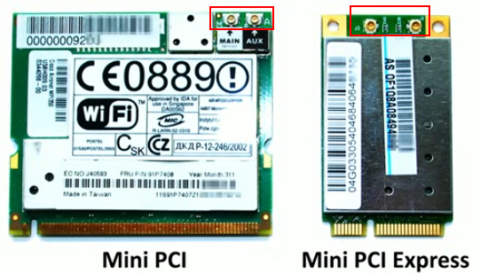
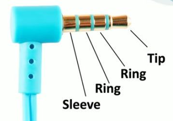
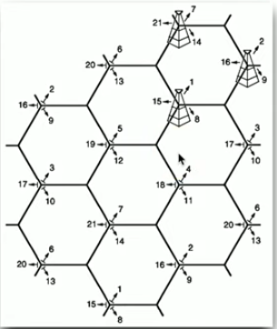

# 1.1 Laptop Hardware

Because of their size and form factor they are challenging to repair

Some laptops are easier to repair than others

The process to fix a computer differs from laptop to laptop

## Laptop batteries

Some laptop batteries are modular and easy to replace others are built into the laptop's motherboard and must be sent to a specialized repair shop for repair

There are two types of laptop batteries:

- Lithium-Ion (Li-ion)
- Lithium-Ion polymer (LiPo)

For these batteries there is no "memory effect" and charging the battery does not diminish it's capacity

## Laptop keyboard

Usually laptop keyboards can be easily replaced by removing a few screws and a single ribbon cable, however it may not always be this simple.  
The keyboard may be swapped out the most on Laptops

Some laptop keyboards could be troubleshooted with the help of external USB keyboards, determining if the problem is with the software of the laptop or with it's keyboard.

Because laptop keyboards are compact there are usually special keys that can be used together with other keys for more functionality.

## Laptop keys

Laptop keys are fragile and if we want to repair one we should read the manual first then me as gentile as possible in removing the key cap in order not to damage the butterfly mechanism of most laptop keyboards.

## Laptop memory

The laptop memory is the Small Outline Dual In-line Memory Module (SO-DIMM) and sometimes it is modular and it can be replaced and sometimes it is attached to the motherboard.

## Laptop storage

There are 2.5" HDDs for laptops but due to their drawbacks most laptops nowadays use either 2.5" SSDs or M.2 SSDs.

Some laptops have modular storage that can be easily replaced others do not have modularity.

## Migrating from HDD to SSD and cloning storage drives

Option 1: Install the OS and all of the apps on the new storage device then manually transfer all of the users files and data from one storage device to the other

Option 2:  Use imaging/cloning software to clone the old hard drive to the new hard drive

Some SSDs have cloning/imaging software included, others do not and we have to use third party software.

Sometimes, we create an **image of the system** and store that image on a **separate/external storage device** like an USB stick. After installing a new drive, we can **restore** the system by copying the image from the external storage device back onto the new drive.

To make the process even faster, we can often **connect both the old and new drives at the same time** and use imaging or cloning software to **copy the contents directly** from one drive to the other in real time.

## 802.11 wireless and Bluetooth

For laptops, wireless network connectivity cards are usually integrated into the motherboard. Some are modular and can be replaced and some aren't

802.11 = Wi-Fi standard

- 802.11 **\= Wi-Fi standard**
    
- Specifies:
    
    - **Frequency bands** (2.4 GHz, 5 GHz, 6 GHz in newer versions)
        
    - **Speed / data rates**
        
    - **Range / coverage**
        
    - **Modulation and encoding methods**
        
- There are **multiple versions** of 802.11, often written with a letter after it (like 802.11a/b/g/n/ac/ax).
    

802.11 is used for LAN (Local Area Network), has high speed and gives access to the internet.  
A Mini PCI or Mini PCI Express card may be used to provide the 802.11 functionality for the laptop. The cards are designed to be modular and these cards have small connectors on them to plug in the antennas that are already built into the laptop.  
 

The red squares mark the location of the connectors for the antennas.

Bluetooth is often referred to as a PAN (Person Area Network) and it is used to connect an external peripheral and other devices to the computer. Some laptops may have separate interface cards for Bluetooth but most laptops have Bluetooth functionality built into the motherboard itself

## Wi-Fi antennas

802.11 interfaces, weather a card or on the board itself, will have two connectors one being the main connector and the other is an aux (auxiliary connector). A third antenna might be used for all of the Bluetooth connections.

The antenna wires commonly wrap around the outside of the laptop's monitor/display.

## Biometrics

Safe, and secure, but require the necessary hardware on the laptop to function.

## Near-field communication (NFC)

It is commonly used on smartphones and smart watches for online contactless payments or authentication.

# 1.2 Connecting Mobile Devices & Mobile Device Accessories

## Connecting Mobile Devices

### USB

Some connections might be used to see if the device is really yours.

- USB Type-A
- USB Type-B
- USB Mini-B
- USB Micro-B
- USB Micro-B 3.0
- USB Type-C
    - 24 pins
    - acts as a USB 2.0/3.0/3.1/4 connection
    - different signals can use the same USB type c connection
    - USB type-c can transmit multiple types of signals such as HDMI, DisplayPort, Thunderbolt etc.
    - can be inserted either way

### Lightning

This is/was Apple's proprietary cable made to overcome some of the limitations of the USB Micro-B. It has 8 pins, can be inserted either way and has high data throughput and higher power output.

### Bluetooth

While Bluetooth is often to connect computing devices to peripherals, it is possible to connect multiple phones and computing devices using Bluetooth.

### Tethering / Hotspot

Hotspot = wireless + multiple devices

Tethering = wireless or wired + only one device

Note!

Phones are the most common, but **any internet-capable device that can share its connection** can do tethering or hotspot. The concept is **sharing internet from one device to others**, not limited to phones.

## Mobile Device Accessories

### Stylus

Make sure the stylus used is compatible with the device

### Headsets

Analog Audio Jack is also called TRRS (Tip Ring Ring Sleeve) and the image shows us why.  

### Docking Stations and Port replicators

They are almost the same the only difference is that a port replicator is more universal using ports such as USB type-c or type-a for connection unlike a docking station which is specific for a particular type of laptop.

# 1.3 Mobile Device Networks & Mobile Device Management

## Mobile Device Networks

Cellular towers cover an area creating a cell. These cells connect together to form the cellular networks. Because phones use these cellular networks they are called cell phones.

The picture illustrates this perfectly  

Cellular networks provide both voice and data communication.

### 3G technology

Cellular technology took off once 3G technology was introduced in 1998.

It allowed us to transmit more data creating the floor for new functionality such as:

- GPS
- Mobile television
- Video on demand
- Video conferencing

&nbsp;

### 4G / LTE

LTE - Long Term Evolution

4G is based on GSM (Global System for Mobile Communications) and EDGE (Enhanced Data Rates for GSM Evolution)

4G/LTE = 150 Mbps

#### LTE Advanced(LTE-A)

LTE-A = 300 Mbps

### 5G

Launched in 2020  
Greater Bandwidth

1.  Theoretical Maximum Speeds:
    
    - Low-band 5G (sub-1 GHz): 50–250 Mbps
    - Mid-band 5G (1–6 GHz, most common): 100 Mbps – 1 Gbps
    - High-band 5G / mmWave (24–100 GHz): up to 10–20 Gbps
2.  Real-World Speeds
    
    - Typical download: 100 Mbps – 2 Gbps, depending on carrier and location
    - Typical upload: 50–200 Mbps
    - Latency: 1–10 milliseconds, much lower than 4G (~30–50 ms)

5G can theoretically reach up to 20 Gbps, but in everyday use most users experience 100 Mbps to 2 Gbps—still much faster than 4G.

Higher-frequency 5G (mmWave) gives faster speeds but covers a smaller area, while lower-frequency 5G covers larger areas but is slower.

5G has a significant impact for IoT being able to transmit data much faster.

### Wi-Fi / 802.11

Most modern cellphones offer Wi-Fi calling so if you don't have great signal but are connected to the internet via Wi-Fi u can use Wi-Fi calling to make a call. It allows to receive and send calls as if we were connected to a Wi-Fi network.

### Hotspot

The phone is transformed into a router.  
It may require additional charges and data costs.

### Subscriber Identity Module (SIM)

The SIM contains information for the carrier (mobile network provider) and the user such as:

- SIM ID
- phone number
- cellular network information
- storage space for contacts (the contacts), messages, etc.

#### eSIM - embedded SIM

Can't be physically removed but they can be transferred from one phone to another

### Bluetooth pairing and process

Bluetooth pairing may sometimes require a PIN in order to connect successfully.  
A certain sequence or startup process may be necessary to have the two Bluetooth discover each other.

### GPS (Global Positioning System)

Created by U.S. D.O.D.

Accurate GPS readings require at least 4 satellites to be visible by your phone.

Differences in the signal received by multiple satellites determine longitude, latitude and altitude

In case GPS does not work properly, Wi-Fi or cellular networks may be used to determine your location.

## 1.3. Mobile Device Management (MDM)

- **Definition:** A centralized system used by organizations to **manage, secure, and monitor entire mobile devices** (smartphones, tablets, laptops) that employees use.
    
- **Scope:** Device-wide control.
    
- **Key Features:**
    
    - Enforce security policies (PIN/password, encryption, device lock)
    - Remote wipe or lock stolen/lost devices
    - Install, update, or remove apps remotely
    - Track device location
    - Configure Wi-Fi, VPN, email, and other system settings
- **Use case:** Corporate-owned devices, where the organization wants full control over the device and all its data.
    

MDM can manage both corporation's devices and BYOD's.  
Specialized software is needed for MDM.  
MDM allows creation of partitions in order to have one private section for the employee and one public section for corporate data.

### BYOD (Bring Your Own Device, Bring Your Own Technology)

The phone is owned by the employee but needs to meet company requirements.  
It is difficult to secure because is both a home device and a work device and in the MDM we need to set rules regarding how is data protected, what part is for work and what part is for the employee, what happens to the data when the phone is sold, traded or lost.

### COPE (Corporate Owned, Personally Enabled)

The device is fully owned and managed by the company however there are instances where the company allows that device to be used as a personal phone.

#### CYOD (Choose Your Own Device)

This is the same thing as COPE only difference is that users can chose a device from a selection provided by the company

### MDM policy enforcement

Any policy enforcement done by the MDM is automatically pushed to all devices.

IMEI - this is a unique identifier found in the MDM

### Mobile Device Synchronization

Mobile Device Synchronization is the process of keeping a mobile device’s data, apps, and settings consistent and up to date with the organization’s servers or cloud systems to ensure users and IT always have the latest, synchronized information and configurations.

### Synchronizing data

- We can choose the type of data to be synchronized:
    - calendar settings
    - contact details
- We can chose in what conditions the data is synchronized:
    - Cellular/Mobile
    - 802.11 (Wi-Fi)
    - This can have significant financial consequences
- We can specify how much cellular data can the phones use, at what time, and for what purpose
    - Contact the carrier for more information
- Control the use of cellular downloads and if automatic downloads are allowed

### Business applications

In the account setting of the device we configure different settings for different business applications. In the account setting we need to provide a username, password or some other authenticator. We can choose what will be synchronized, however the synchronization settings for each application may be different.