# 2.1 Introduction to IP & Common ports

## 2.1. a) Introduction to IP

TCP and UDP are transport protocols (Layer 4 in OSI model) used to transfer data over IP networks.  
TCP is slower but reliable  
UDP is faster but less reliable

TCP and UDP allow for multiplexing over the internet (the process of sending multiple streams of data from different applications or services over a single network connection simultaneously.). This multiplexing over the internet is possible because of TCP and UDP port numbers (ports).

### TCP

TCP is a connection-oriented protocol (it establishes a connection before it sends the data)  
TCP is also known as "reliable" delivery because it follows a formal process to ensure that the data has been sent correctly. This formal process is called the three way handshake.  
TCP also allows for **flow control** where the receiver tells the sender how much data can be sent at any time.

### UDP

UDP is a connectionless protocol (it does not establish a connection before it sends the data)  
UDP is known as "unreliable" delivery because it does not offer any formal process to ensure the data was sent correctly.  
UDP does not allow **flow control** and the sender is the only one who determines the amount of data transmitted.

#### Why use UDP?

Real-time communication such as VoIP or video calls would prefer to use UDP because of it's little overhead, and because it does not have to worry about resending traffic that may have been lost.

While UDP does not provide tracking of the data, the application can provide the functionality.  
Some applications might not do anything if data is lost.

#### Connection-oriented vs Connectionless protocols

Any application protocol that uses UDP is a connectionless protocol

Examples

- **DHCP** (Dynamic Host Configuration Protocol)
- **TFTP** (Trivial File Transfer Protocol)
- **DNS** (Domain Name System, for queries)
- **SNMP** (Simple Network Management Protocol)
- **Streaming protocols** like **RTP** (Real-time Transport Protocol) in some cases

Any application protocol that uses TCP is a connection-oriented protocol.

Examples:

- **HTTP / HTTPS** (Web browsing)
    
- **FTP** (File Transfer Protocol)
    
- **SMTP** (Simple Mail Transfer Protocol, for sending emails)
    
- **IMAP / POP3** (Email retrieval)
    
- **SSH** (Secure Shell)
    
- **Telnet** (legacy remote access protocol)
    

### IP addresses, protocols, port numbers

When sending or receiving data over the internet the IP address, protocol and port number are the information necessary for a computer to know where each piece of information should go.

Important information for both server and client

- Server IP address, protocol used (TCP/UDP), server application port number
- Client IP address, protocol used (TCP/UDP), client application port number

#### Non-ephemeral and Ephemeral ports

- **Non-ephemeral (well-known) ports / permanent ports:**  
    Ports reserved for specific, widely used services and applications.
    
    - Range: **0 to 1023**
    - Typically used by **servers or system services**
- **Ephemeral (dynamic) ports / non-permanent ports:**  
    Ports automatically assigned by the **operating system** to client applications when needed.
    
    - Range: **1024 to 65535**
    - Used for **temporary connections initiated by clients**

#### Port numbers for TCP and UDP

Both TCP and UDP ports range from 0 to 65535. It is important to keep in mind that a TCP port 80 is not the same as a UDP port 80.

Port numbers are only for communication not security.  
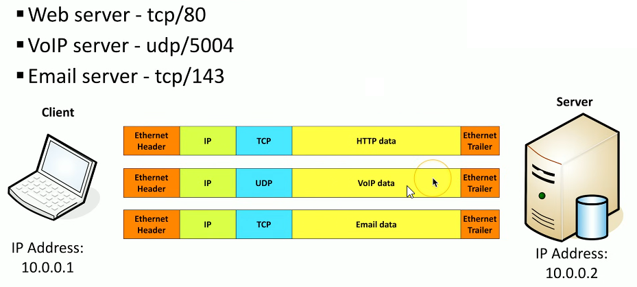

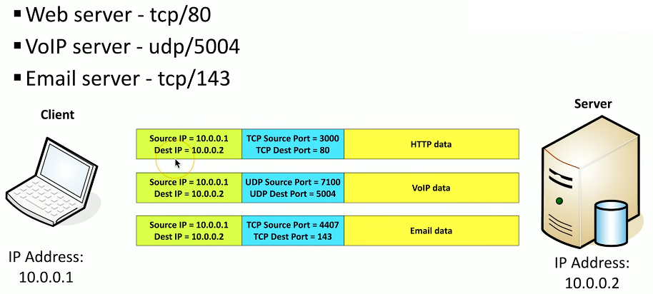

## 2.1 b) Common ports

### FPT - File Transfer Protocol (TCP/20) (TCP/21)

TCP/20 (active mode data)  
TCP/21 (control)

- FTP protocol requires authentication with a username and password
    
    - some systems use a generic/anonymous login such that no authentication is required
- Full-featured functionality
    
    - We can transfer, list, add, delete, ad perform other administration functions to a file

### SSH - Secure Shell (TCP/22)

TCP/22 - provides encrypted connection to linux machines  
looks and acts the same as Telnet

### Telnet - Telecommunication Network (TCP/23)

TCP/23 - same as ssh however it unencrypted (no security)

### SMTP - Simple Mail Transfer Protocol (TCP/25)

- SMTP
    - Server to server mail transfer
    - TCP/25

Some devices are configured to send emails to the email server initially with the help of the SMPT protocol.

- you may configure SMTP on the mail server but you may also configure SMTP on your local device.

IMAP or POP3 are the protocols used to receive email

### DNS - Domain Name System (UDP/53 )

UDP/53  
DNS converts IP addresses to domain names  
Usually multiple DNS servers are in production

### DHCP - Dynamic Host Configuration Protocol (UDP/67) (UDP/68)

DHCP - automatically assigns a device the right network settings so it can connect and talk to other devices without you having to configure anything manually.

The network settings assigned by DHCP to a device are:

- IP address
- Subnet Mask
- Default Gateway
- DNS Server
- Lease Time
- Optional settings such as WINS server (for older Windows networks), NTP server (for time synchronization), Domain name (for the network domain), Router or DHCP options for VoIP, PXE boot, etc.

The DHCP service could be integrated into a server, appliance or SOHO router

Dynamically allocated IP addresses are leased/rented to a device. When that lease is up the device can either renew it's IP address or put that IP address back into the pool if dynamically allocated IP addresses.

System administrators can also use DHCP to manually configure IP addresses that will always be assigned to particular devices (that IP address won't change)

### HTTP (TCP/80) & HTTPS (TCP/443)

HTTP - Hypertext Transfer Protocol (unencrypted traffic) (TCP/80)  
HTTPS - Hypertext Transfer Protocol Secure (encrypted traffic) (TCP/443)

### POP3 (TCP/110) & IMAP4 (TCP/143)

- POP3 - Post office Protocol version 3
    - offers basic mail transfer functionality
    - TCP/110
- IMAP4 - Internet Message Access Protocol v4
    - includes management of email inbox
    - TCP/143

IMAP provides a number of additional features not available in POP3, such as the management of the inbox from multiple clients.  
You're able to make folders and transfer emails into those folders, and all of those updates will be synchronized across all of your different systems. And all of those updates will be synchronized across all of your different email clients.

### SMB / CIFS \*

If you're using Microsoft Windows, there’s a process for transferring data within Windows that uses a protocol named **Server Message Block (SMB)**.  
You may also see this referred to as the **Common Internet File System (CIFS)**.

SMB is not only used for file transfers — it’s also used to send information to printer queues and for other processes where Windows needs to communicate between different devices.

Older Windows devices used an additional protocol inside TCP/IP called **NetBIOS**. This protocol used two primary port numbers to communicate:

- **UDP port 137** – used for NetBIOS name service, similar to DNS.
- **TCP port 139** – used to set up sessions for file transfers.

On most modern versions of Windows, direct connectivity between IP addresses no longer uses the NetBIOS protocol. This is called **direct communication** or **NetBIOS-less communication**, which often uses **TCP port 445**.

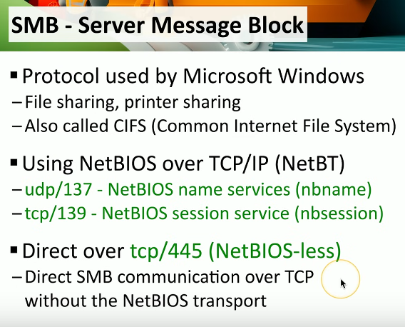

### LDAP (TCP/389) / LDAPS

LDAP - Lightweight Directory Access Protocol (TCP/389)  
LDAPS - Lightweight Directory Access Protocol Secure (TCP/633)

Most organizations have a **central database** that contains all the important information about devices, users, and resources available on their network.  
This is usually a **directory service or database**, and to access it, we use a standard set of protocols.

One of these protocols is **LDAP (Lightweight Directory Access Protocol)** or **LDAPS (Lightweight Directory Access Protocol Secure)**.

- LDAP commonly uses **TCP port 389**.

The directory is usually organized into different categories, such as:

- **Organization**
- **Organizational Unit (OU)**
- **Common Name (CN)**

For example, at Messer Studios, there might be:

- A **Production OU**
- A **Support OU**
- An **Engineering OU**

Within these units, there may be individuals with a **common name**, such as Sam or Daniel.  
There might also be databases like **Tech Docs**.

Using LDAP, we can:

- Locate these components
- Provide additional details, such as **authentication for individual users**

A very common use of LDAP is **Microsoft’s Active Directory**, where the database can be referenced using the LDAP protocol.

* * *

If you want, I can also **make a compact bullet-point summary of LDAP and its structure** for easier studying. Do you want me to do that?

### RDP (TCP/3389)

RDP - Remote Desktop Protocol

If you are troubleshooting technology, you’re probably familiar with **remote access** to another machine.

With users located around the world, it’s not practical to visit each user in person to solve problems on their computer. In these cases, we use **remote access protocols**, such as **RDP (Remote Desktop Protocol)**.

- RDP allows you to **view and control the desktop** of a remote device.
- It uses **TCP port 3389**.
- Primarily used for **Windows devices**, but you can also access them from other operating systems.

You can use RDP to:

- Control an **entire computer**
- Run a **single application** on the remote computer

Although RDP is commonly associated with Windows, many **RDP clients** exist for **Mac OS, Linux, Unix, iPhone, and other operating systems**, allowing cross-platform remote access.

Table of all ports mentioned:

| **Port** | **Protocol** | **Service / Description** |
| --- | --- | --- |
| **TCP/20** | TCP | **FTP (File Transfer Protocol)** – Active mode data transfer |
| **TCP/21** | TCP | **FTP (File Transfer Protocol)** – Control/command channel |
| **TCP/22** | TCP | **SSH (Secure Shell)** – Secure remote login and command execution |
| **TCP/23** | TCP | **Telnet** – Unencrypted remote login (legacy) |
| **TCP/25** | TCP | **SMTP (Simple Mail Transfer Protocol)** – Sends email between servers |
| **UDP/53** | UDP | **DNS (Domain Name System)** – Translates domain names to IP addresses |
| **UDP/67** | UDP | **DHCP (Dynamic Host Configuration Protocol)** – Server side (assigns IP settings) |
| **UDP/68** | UDP | **DHCP (Dynamic Host Configuration Protocol)** – Client side (receives IP settings) |
| **TCP/80** | TCP | **HTTP (Hypertext Transfer Protocol)** – Unencrypted web traffic |
| **TCP/110** | TCP | **POP3 (Post Office Protocol v3)** – Retrieves email from mail servers |
| **TCP/143** | TCP | **IMAP4 (Internet Message Access Protocol v4)** – Manages and syncs email inboxes |
| **UDP/137** | UDP | **NetBIOS Name Service** – Name resolution for older Windows systems |
| **TCP/139** | TCP | **NetBIOS Session Service** – File and printer sharing for older Windows |
| **TCP/389** | TCP | **LDAP (Lightweight Directory Access Protocol)** – Directory service for authentication and resource lookup |
| **TCP/445** | TCP | **SMB (Server Message Block)** – File, printer, and resource sharing (NetBIOS-less) |
| **TCP/443** | TCP | **HTTPS (Hypertext Transfer Protocol Secure)** – Encrypted web traffic |
| **TCP/636** | TCP | **LDAPS (Lightweight Directory Access Protocol Secure)** – Secure LDAP communication over SSL/TLS |
| **TCP/3389** | TCP | **RDP (Remote Desktop Protocol)** – Remote access and desktop control for Windows systems |

# 2.2. Wireless Network Technologies

## IEEE standards of wireless technologies

IEEE - institute of electrical and electronic engineers

The committee responsible for wireless local area networks (Wi-Fi) is the IEEE 802.11 Working Group, which operates under the IEEE 802 LAN/MAN Standards Committee (802.11 committee).

All Wi-Fi networks follow these standards

- 802.11ac is Wi-Fi 5
- 802.11ax is Wi-Fi 6 and Wi-Fi 6E (extended)
- 802.11be is Wi-Fi 7
- Future versions will increment accordingly

## 802.11 technologies

### Frequencies

- 2.4 GHz, 5 GHz, 6 GHz
- Sometimes a combination

### Channels

- The 802.11 committee / the IEEE has grouped the frequencies into channels
- Frequencies are managed by governing entities (the state of each country)
- Using non-overlapping channels would be optimal

We can see these channels being used if we look at the wireless configuration for our device.

### Frequencies and Bandwidths

A Wi-Fi signal has a **central frequency** and a **bandwidth**, where the bandwidth represents the range of spectrum (EMS) the signal can occupy at any time. To determine the **maximum (fₘₐₓ) and minimum (fₘᵢₙ) frequencies** of the signal, you divide the bandwidth by 2 and add or subtract that value from the central frequency. Bandwidth cannot be set arbitrarily—it must follow **regulatory limits and standard Wi-Fi channel widths**—and if two signals have overlapping frequency ranges, they can **interfere**, causing reduced performance or connection issues.

- Typical bandwidths for Wi-Fi signals are:
    - 20 MHz
    - 40 MHz
    - 80 MHz
    - 160 MHz

### 802.11 spectrums divided by different bandwidths

The picture bellow shows us each Wi-Fi spectrum divided by the bandwidth written on the left. When we choose a signal for our Wi-Fi we select one of those divisions (segments) from a specific bandwidth

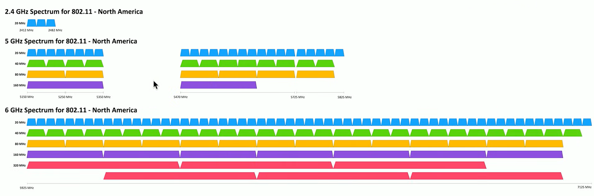

## Bluetooth

- Uses the 2.4 GHz range
    - 2.4 GHz is a.k.a. Unlicensed ISM (Industrial, Scientific and Medical) band
    - Same as 802.11

## RFID (Radio-frequency identification)

RFID tags store information and can communicate it without a battery. RFID tags are passive and stay dormant until a reader scans them, sending them energy via radio waves. That energy is enough for them to “wake up” and send back their ID / code / information to the scanner.

Some RFID tags have a battery which can be activated in order to be scanned from farther away.

RFID is one way communication from the tag to the scanner/device

## NFC (Near Field Communication)

NFC builds on RFID with two way communication.

NFC is often used together with Bluetooth or Wi-Fi in order for the configuration parameters to be set.

# 2.3 Network services

## DNS - Domain Name System

Converts domain names to IP addresses  
DNS servers are usually managed by ISP or enterprise IT departments

## DHCP - Dynamic Host Configuration Protocol

Automatic IP address configuration

Available on most SOHO routers  
For Enterprise there are multiple DHCP servers for redundancy

## File share

Provides a way to centrally store information and files

- The applications, OS, and devices determine the standard system of file management that you are using
    - SMB (Server Message Bloc) (for windows)
    - Apple File Protocol (AFP) (for apple devices)
    - etc.

The OS tends to hide the protocols for file share

## Print server

print serve could be a separate computer or it could be built into the printer itself

The documentation tells us the type of printing protocols the printer uses. Some of them are:

- SMB (Server Message Block)
- IPP (Internet Printing Protocol)
- LPD (Line Printer Daemon)

## Email server

Email servers may be in the cloud or the enterprise may have local email servers that are managed by the employees

Very high uptime expectations (24/7 support)

## Syslog protocol

We want to consolidate all of the log files into a centralized database.

SIEM (Security Information and Event Manager) - it is a central server (central consolidation point) for all of our log files. Allows to corelate information together even accros very divers systems.

SIEM server (syslog server) will have a lot a log space available

## Web server

When requesting information with the help of a browser we request it from a web server with the help of either the HTTP or HTTPS protocol

## Authentication serve

- Authentication, Authorization and Accounting (AAA) server (AAA server)
    - it checks your username and password then provides access to any services you might need
    - usually has a centralized database so that you can easily administer all of the users on your network all from one central point. This DB could be on the server itself or connected to the server
    - almost always an enterprise service
    - redundant authentication servers are created for constant security and redundancy

## Database servers

### Relational databases

They store information in tables that have rows and columns and these tables have logical relationships between them.  
These databases use SQL (Structured Query Language)

### Non-Relational databases

They store information in collections or documents instead of tables, and the data is often organized in a flexible, unstructured, or semi-structured format such as JSON or key-value pairs.  
These databases use queries specific to their type, rather than SQL — for example, document-based queries or APIs.

## NTP server

NTP - network time protocol  
Time is used for encryption, backups, log timestamps  
Many encryption technologies require that all of our systems run with the correct date and time

A company has one or more NTP servers running that are referencing a central clock (Stratum 0 devices, Stratum 1 servers, Stratum 2 (and lower) servers)

The computer requests the time from the NTP servers.

## Spam gateways

It is a separate service on the cloud or on a server that evaluates if the mail received is legit or spam.

## All-in-one security appliance

They can be referred as: Next-generation firewall, Unified Threat Management (UTM), Web security gateway

- Have many different functions combined into one device  
    Functions include:
    - URL filter / content inspection
    - malware inspection
    - spam filter
    - CSU/DSU
    - Router, switch interfaces
    - Firewall
    - IDS/IPS
    - Bandwidth shaper
    - VPN endpoint

## Load balancer

Load balancers connect many devices at the same time and share the load across those many systems.

**A load balancer sits in front of a group of servers and spreads the work evenly among them.**

If a server goes down the load balancer spreads the load to the other computers such that work can still be done while the technicians take care of the problem. This proccess of rebalancing the load between servers is fast and users don't notice it

## Proxy server

**Proxy Server:** Acts as a **middleman** between a client and a server — it receives the client’s request, evaluates or modifies it, forwards it to the server, receives the server’s response, evaluates or modifies it if needed, and then sends it back to the client.

**Benefits:**

- **Privacy & Anonymity:** Hides the client’s IP address.
- **Security:** Scans traffic and blocks malicious content.
- **Content Filtering & Access Control:** Restricts or allows websites.
- **Caching & Performance:** Speeds up repeated requests.
- **Monitoring & Logging:** Tracks user activity for analytics or compliance.
- **Geo-bypassing:** Access region-restricted content.

## SCADA / ICS

SCADA - Supervisory Control and Data Acquisition  
ICS - Industrial Control System

It is used on large industrial equipment.

Requires extensive segmentation and no access from the outside

## Legacy and embedded systems

Old systems are named legacy systems. Legacy systems might be the most important systems in the company.

Embedded systems are purpose built device where we don't have direct access to the OS. Does not require much maintenance  
Examples: alarm system, door security, time card system.

## IoT (Internet of Things) devices

Broad category of devices such as:

- appliances: refrigerators
- smart devices: smart speakers
- air control: thermostats, temperature control
- access: smart doorbells, doors and windows

Companies that make these devices usually are not good at securing these devices and connecting them to the network. This is why these devices might need netwrok segmentation.

# 2.4 DNS Configuration, DHCP, VLANs and VPNs

## DNS Configuration

### DNS (Domain Name System)

DNS (Domain Name System) is a distributed database that maps fully qualified domain names (FQDNs) to IP addresses. Its servers are organized hierarchically and distributed globally, ensuring reliability, scalability, and redundancy across the Internet.

- DNS has:
	- 13 root server clusters (Over 1000 actual servers)
	- hundreads of generic top-level domains (gTLDs); e.g. .com, .org, .net, etc.
	- over 275 country code top-level domains (ccTLDs); e.g. .us, .ro, .de, .md

### The DNS hierarchy

The **DNS hierarchy** is structured in layers:

1. **Root servers** — at the top; they direct queries to the correct **Top-Level Domain (TLD)** servers (e.g., .com, .org, .ro).
2. **TLD servers** — store information about where to find the **authoritative servers** for each domain within that TLD.
3. **Authoritative servers** — hold the actual DNS records (like IP addresses) for specific domains.
4. **Local/resolver servers** — used by clients to cache and query the hierarchy on behalf of users.

🧠 **In short:**
The root servers point to TLD servers → TLD servers point to authoritative servers → authoritative servers return the domain’s IP address. Enterprises can also plug into this model by running their own authoritative and resolver (recursive) DNS servers: internal authoritative servers host private records (for example, trey.east.jinox.com) and local resolvers answer client queries—often using split-horizon (internal-only) records so trey.east.jinox.com can resolve to an employee-only web page or internal IP that isn’t published on the public Internet.

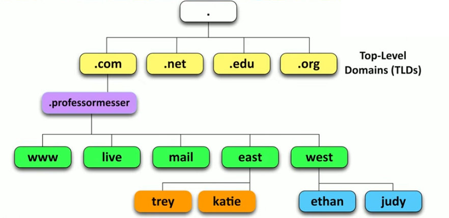
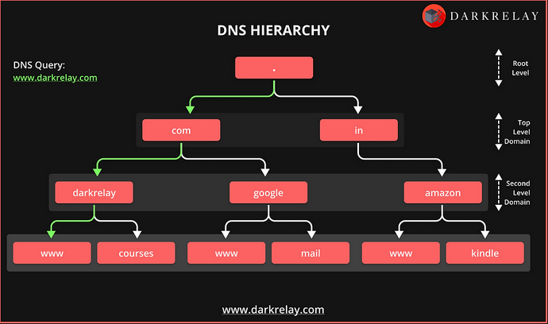

### DNS lookup

#### dig command

On macOS or Linux we can use the `dig` command to do a DNS lookup on a fully qualified domain name (FQDN).

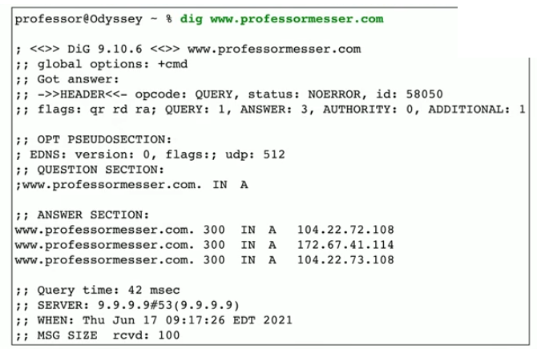

The picture above shows an example of a DNS lookup done with `dig` command. It shows 3 possible IP addresses because the www.professormesser.com has a redundant series of web servers so if one goes done another can come and replace it.

#### nslookup command

On Windows OS we can use the `nslookup` command to do a DNS lookup on a fully qualified domain name (FQDN).

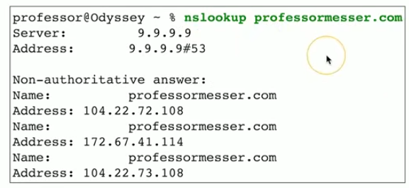

### DNS records

A DNS query sent to a DNS server retrieves resource records that contain important information such as IP addresses, certificates, email details, and aliases. Because of the complexity and sensitivity of these records, DNS configuration should only be handled by knowledgeable individuals. If you are required to make a change to a DNS server remember to always have a backup and a way to return to that backup.

### Example of DNS configuration

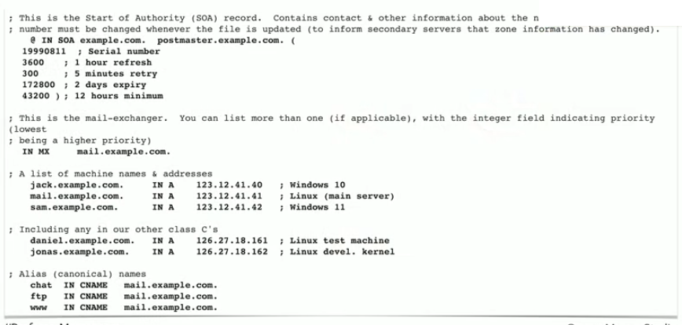

The picture above shows the configuration (configuration file or page) of a DNS server.

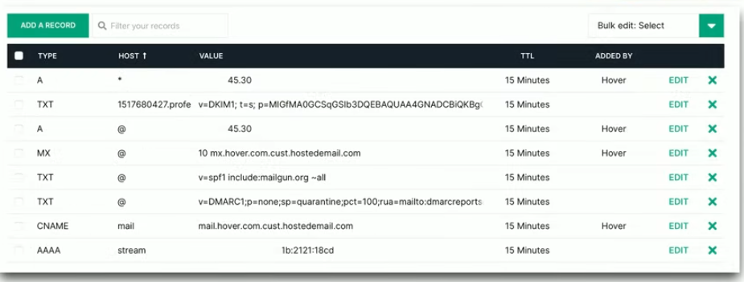

The picture above shows a scenario where a DNS server does not provide direct access to the configuration file however it provides a webfront end where changes can be made

### Records of DNS servers

#### Address records (A or AAAA)

A and AAAA records define the IP address of a particular FQDN (Fully Qualified Domain Name)

A records are for IPv4 addresses
AAAA records are for IPv6 addresses

Example in a DNS configuration file:
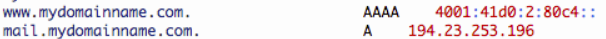

Example on a web front-end:
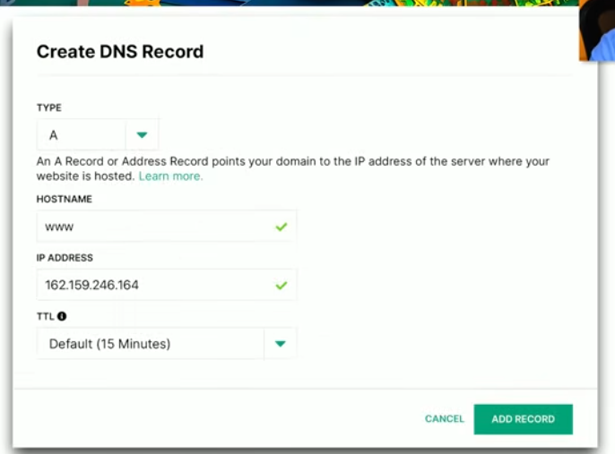


TTL - Time To Live
TTL for DNS is the time that the computer can hold the IP address related to the FQDN, before it has to request it again. The request that happens after TTL has ran out happens in the backgroun and does not cause the web page to refresh.
This TTL is helpful because it allows us to make changes to the IP addresses at any time without puting the system on hold, and the changes will be rolled out once TTL is over.

#### Canonical name records (CNAME)

CNAME records create aliases for FQDNs, allowing multiple fully qualified domain names to ultimately resolve to the same IP address.
CNAME records allow different hostnames within a domain to act as aliases for a canonical FQDN, so they all resolve to the same IP address.

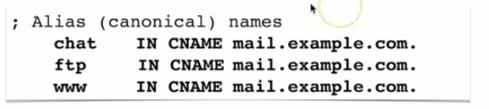

The example shows that chat.example.com, ftp.example.com, and www.example.com are all aliases that ultimately resolve to the same FQDN (or server), mail.example.com, and therefore the same IP address.

The canonical records stay the same even if we change the IP address of mail.example.com

#### Mail exchanger records (MX)

MX records define the FQDN of the mail server responsible for a domain (domain name). The actual IP is determined via the A (or AAAA) record of that FQDN

The MX record tells mail servers: “To deliver email for, example.com, send it to mail.example.com (the FQDN of the mail server).”

example.com → MX → mail.example.com
mail.example.com → A record → 192.0.2.10

The flow of data for MX records is this: The client references the our DNS server, the DNS server looks up the MX record, the MX record is resolved to a particular FQDN, then DNS server looks up the A (or AAAA) record of that FQDN to find its IP address, which is then sent back to the client.

Each domain has it's own set of MX records, meaning that one domain can have multiple MX records for multiple email servers.

### Text records (TXT)

The DNS server can store important infomration that we would like others to access. This information is stored in text records (TXT).

These records are human readable records than anyone can access/reference from a DNS server.

The command `dig professormesser.com txt` can be used on Linux machines and macOS machines to see the text records of professormesser.com DNS.
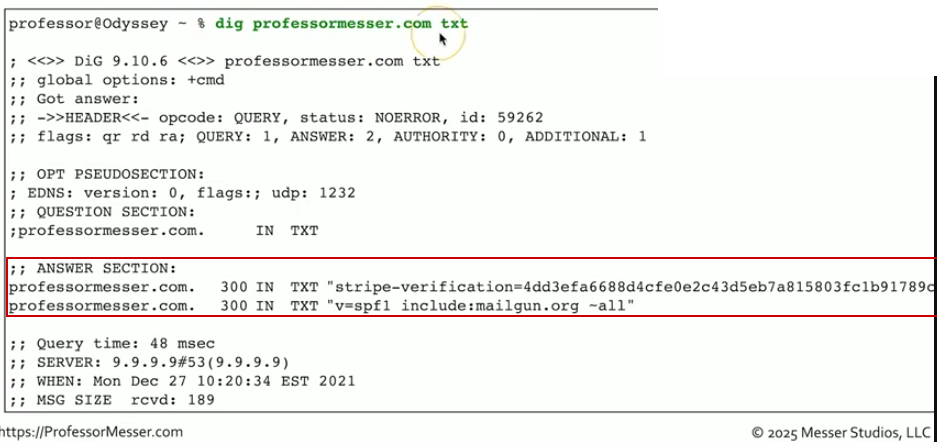

The command  `nslookup -type=txt google.com` can be used on Windows machines to see the text records of google.com

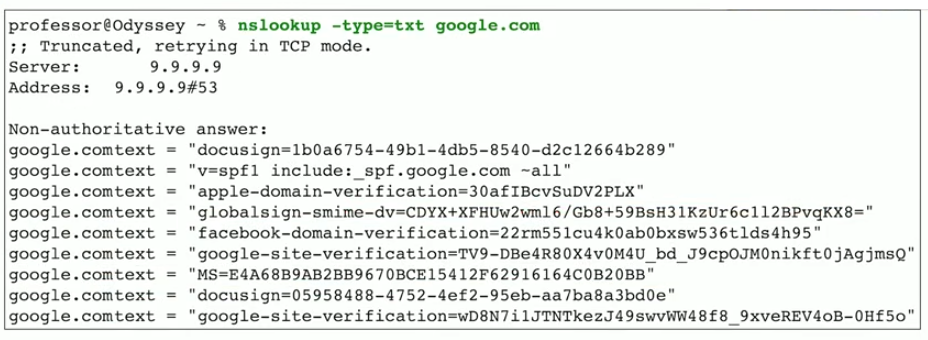


### Authentication methods that use TXT records

#### 1. **DKIM (DomainKeys Identified Mail) TXT Record**

* **Purpose**: Contains the public key used to verify email signatures and ensure that emails are authentic and untampered with.
* **Example**:

  ```
  "v=DKIM1; k=rsa; p=MIIBIjANBgkqh..."
  ```
* **Usage**: Email servers use this public key to verify DKIM signatures in incoming emails.

The sender has a private key that creates a digital sinature for each email sent. The email is sent with that signature along with the public key.
The public key can only be used to verify the signature while the private key make the signature. Private key of the sender is hidden while public key of the sender is public and when a receiver wants to see if the email really did come from the sender the receiver uses the public key inside the DKIM text record to verify if the signature is legit or not.

Example:
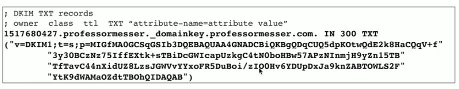

Web based front-end configuration:
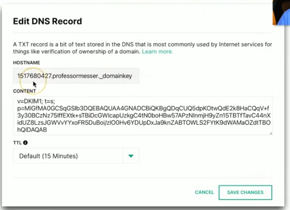

DKIM answers the question: Was this email really sent by this domain, and has it been tampered with

---

#### 2. **SPF (Sender Policy Framework) TXT Record**

* **Purpose**: Defines which mail servers are authorized to send emails on behalf of your domain.

* **Example**:
  ```
  "v=spf1 include:_spf.google.com ~all"
  ```

* **Usage**: Used to prevent email spoofing by specifying trusted email senders.

It is common for an organization to send email from multiple sources. To confirm that these sources are authorized to send email on the organization’s behalf, we use SPF. SPF, together with the sending server’s IP address, creates a layer of security that helps recipients verify whether an email claiming to come from a particular domain actually originated from an authorized server for that domain.

Example of SPF:
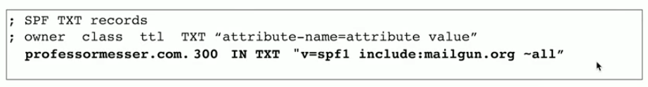

Example of SPF configuration on front-end:
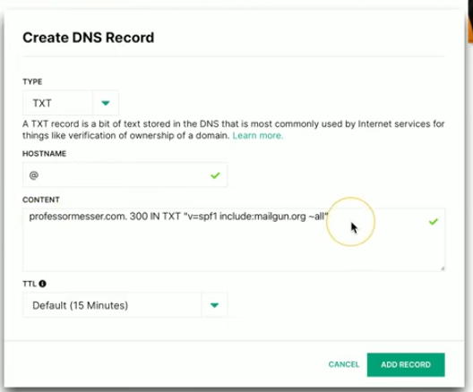

SPF answers the question: Is this server allowed to send email for this domain?

---


#### 3. **DMARC (Domain-based Message Authentication, Reporting, and Conformance) TXT Record**

* **Purpose**: Provides a policy for how mail servers should handle messages that fail SPF or DKIM checks, and offers reporting mechanisms.

* **Example**:
  ```
  "v=DMARC1; p=reject; rua=mailto:dmarc-reports@example.com"
  ```

* **Usage**: Helps prevent email phishing and fraud by specifying actions for failed email authentication.

DMARC answers the question:  What should a receiver do if SPF or DKIM checks fail?

Example of DMARC configuration telling receviers to put the message into their quarantine folder / spamm folder, and thake the results of the dispozition of that message and send it to an email to be used for reports:
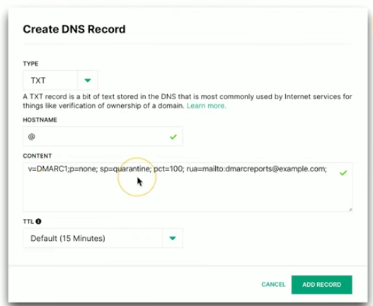


---

#### 4. **TXT Records for Domain Ownership Verification**

* **Purpose**: Used by services (like Google, Microsoft, etc.) to verify that you own the domain before granting access to their services (like email or cloud services).
* **Example**:

  ```
  "google-site-verification=abc123xyz"
  ```
* **Usage**: Used to prove domain ownership during service setup.

---

#### 5. **CAA (Certificate Authority Authorization) TXT Record**

* **Purpose**: Specifies which **Certificate Authorities (CAs)** are allowed to issue SSL/TLS certificates for your domain.
* **Example**:

  ```
  "0 issue 'letsencrypt.org'"
  ```
* **Usage**: Helps prevent unauthorized certificate issuance for your domain.

---

#### 6. **MTA-STS (Mail Transfer Agent Strict Transport Security) TXT Record**

* **Purpose**: Defines policies for how mail servers should enforce secure connections (TLS) when communicating with your mail server.
* **Example**:

  ```
  "v=STSv1; id=20211005T123456Z"
  ```
* **Usage**: Used to enforce security standards and avoid man-in-the-middle attacks on email.

---

#### 7. **TLS-RPT (TLS Reporting) TXT Record**

* **Purpose**: Specifies where to send reports about failed TLS connections to your mail server.
* **Example**:

  ```
  "v=TLSRPTv1; rua=mailto:tls-report@example.com"
  ```
* **Usage**: Helps domain owners monitor and address issues with email encryption.

---

#### 8. **SSHFP (SSH Fingerprint) TXT Record**

* **Purpose**: Stores the **fingerprints of SSH public keys** for the domain, used to verify SSH server identity.
* **Example**:

  ```
  "sshfp 1 1 27e9b..."
  ```
* **Usage**: Helps prevent Man-in-the-Middle attacks for SSH connections.

---

#### 9. **OpenPGP Key TXT Record**

* **Purpose**: Stores OpenPGP public keys for email encryption or other uses.
* **Example**:

  ```
  "v=OpenPGP4i; a=rsa4096; k=3C1A1..."
  ```
* **Usage**: Allows others to fetch your public PGP key for encrypting messages to you.

---

#### 10. **TXT Records for Custom Purposes**

* **Purpose**: Used to store **arbitrary text-based information** for custom purposes, such as configuration or messages.
* **Example**:

  ```
  "example=custominfo"
  ```
* **Usage**: Can be used for anything a domain owner needs to store in DNS, such as internal identifiers or configuration data.

---

### **Summary Table**:

| **TXT Record Type**               | **Purpose**                                                     |
| --------------------------------- | --------------------------------------------------------------- |
| **SPF**                           | Specifies authorized email servers for a domain.                |
| **DKIM**                          | Stores the public key for verifying email signatures.           |
| **DMARC**                         | Defines policies for handling email failures (SPF/DKIM).        |
| **Domain Ownership Verification** | Proves domain ownership to services (e.g., Google, Microsoft).  |
| **CAA**                           | Restricts which Certificate Authorities can issue certificates. |
| **MTA-STS**                       | Enforces secure (TLS) email communication.                      |
| **TLS-RPT**                       | Sends reports about TLS connection issues.                      |
| **SSHFP**                         | Stores SSH public key fingerprints for verification.            |
| **OpenPGP Key**                   | Stores OpenPGP public keys for email encryption.                |
| **Custom TXT Records**            | For storing any custom text-based information.                  |

---

### **Key Takeaways**:

* **TXT records** are versatile and can be used for a variety of purposes, especially in **email authentication**, **security**, and **verification**.
* The most common ones in email are **SPF**, **DKIM**, and **DMARC**, but there are also others like **CAA**, **MTA-STS**, and **SSHFP**.


## DHCP


