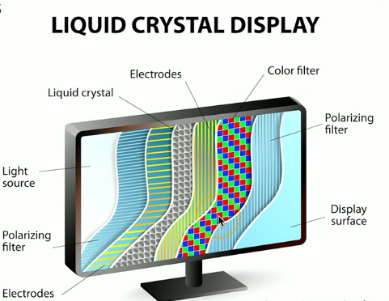
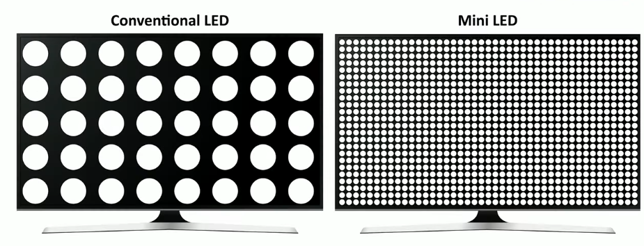
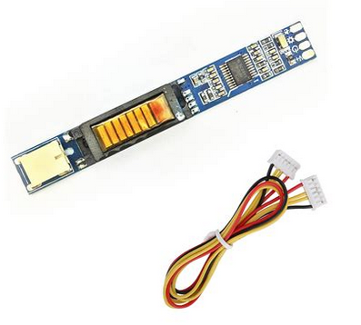

# 3.1 Display Types

## LCD (Liquid Crystal Display)

Lights shine through liquid crystals
- Advantages
	- Lightweight
	- Relatively low power
	- Relatively inexpensive
- Disadvantages
	-  Black levels are a challenge
	-  Requires separate backlight
		-  Florescent (old), LED (Light Emitting Diode)
		-  Lights can be difficult to replace

### LCD technologies

1. TN (Twisted Nematic) LCD
	- The original LCD technology (the very first)
	- Fast response time (good for gaming)
	- Poor viewing angles - color shifts

2. IPS (In Plane Switching) LCD
	-  Excellent color representation
	-  Can be more expensive to produce than TN
3. VA (Vertical Alignment) LCD
	- A good compromise between TN and IPS
	- Good color representation
	- Often slower response times than TN

## OLED (Organic Light Emitting Diode) display

- OLED displays do not have a backlight
- OLED displays have a organic compound that emits light when receiving an electric charge
-  Thinner and lighter
-  Flexible and mobile - no glass needed
-  Great for tablets phones and smart watches
-  Very accurate color representation
-  Tends to be a bit higher cost than LCD

## Mini LED

Mini LED is a type of LCD display that uses thousands of very small LEDs as an advanced backlight system.

- Each LED can be enabled or disabled
- color and intensity can be different
- much better color over dark screen areas
- deeper blacks better color representation

## Digitizers and Touchscreens

### 🔹 **Broad (general) definition**

- A **digitizer** is *any device* that converts **analog (real-world, continuous) information** into **digital (discrete, numeric) data** that a computer can process.

Examples of “digitizers” in this general sense:

* 🎤 A **microphone** digitizes sound waves into digital audio.
* 📷 A **camera sensor** digitizes light into digital images.
* 🖋️ A **graphics tablet** digitizes hand movements or pen strokes.
* 📡 A **scanner** digitizes printed images into digital files.
* 🕹️ Even a **Kinect** (as you mentioned earlier!) digitizes 3D motion into digital position data.

### 🔹 **Narrow (touchscreen-specific) definition**

In touchscreen or pen-input contexts, the word *“digitizer”* has a **specialized meaning**:

- It refers specifically to the **touch-sensing layer** of a display or tablet that converts **finger or stylus movement** into **digital coordinates** that the device can process.

That’s how it’s most often used in consumer electronics (phones, tablets, laptops, etc.).

---

### 🔹 **Both perspectives**

| Context                     | What “digitizer” means                 | Example                    |
| --------------------------- | -------------------------------------- | -------------------------- |
| **General (technical)**     | Any device that turns analog → digital | Microphone, camera, Kinect |
| **Specific (touchscreens)** | Touch or pen input sensor layer        | iPad or Surface digitizer  |

## Backlight and inverter

### Backlight
- LCD displays use backlights such as:
	- florescent
	- LED lights

### Inverter

Fluorescent-backlit LCD displays require an inverter to convert low-voltage DC power into high-voltage AC to operate the CCFLs, whereas modern LED-backlit LCDs don’t need an inverter, as LEDs run directly on low-voltage DC.

## Troubleshooting

- To verify backlight 
	- look at the screen closely
	- use a flashlight to luminate the screen
	- texture graphics on the screen that are faint indicate a problem with the backlight

- In case of issues we either replace the dislay or the LCD inverter 

