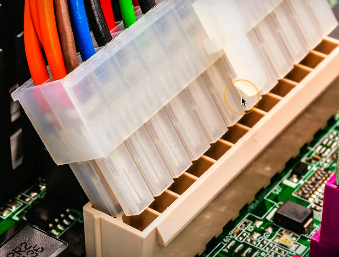

# 3.1 Display Types & Display Attributes

# 3.1.1 Display Types

## LCD (Liquid Crystal Display)

Lights shine through liquid crystals

- Advantages
    - Lightweight
    - Relatively low power
    - Relatively inexpensive
- Disadvantages
    - Black levels are a challenge
    - Requires separate backlight
        - Florescent (old), LED (Light Emitting Diode)
        - Lights can be difficult to replace


### LCD technologies

1.  TN (Twisted Nematic) LCD
    
    - The original LCD technology (the very first)
    - Fast response time (good for gaming)
    - Poor viewing angles - color shifts
2.  IPS (In Plane Switching) LCD
    
    - Excellent color representation
    - Can be more expensive to produce than TN
3.  VA (Vertical Alignment) LCD
    
    - A good compromise between TN and IPS
    - Good color representation
    - Often slower response times than TN

## OLED (Organic Light Emitting Diode) display

- OLED displays do not have a backlight
- OLED displays have a organic compound that emits light when receiving an electric charge
- Thinner and lighter
- Flexible and mobile - no glass needed
- Great for tablets phones and smart watches
- Very accurate color representation
- Tends to be a bit higher cost than LCD

## Mini LED

Mini LED is a type of LCD display that uses thousands of very small LEDs as an advanced backlight system.

- Each LED can be enabled or disabled
- color and intensity can be different
- much better color over dark screen areas
- deeper blacks better color representation  
    

## Digitizers and Touchscreens

### 🔹 **Broad (general) definition**

- A **digitizer** is *any device* that converts **analog (real-world, continuous) information** into **digital (discrete, numeric) data** that a computer can process.

Examples of “digitizers” in this general sense:

- 🎤 A **microphone** digitizes sound waves into digital audio.
- 📷 A **camera sensor** digitizes light into digital images.
- 🖋️ A **graphics tablet** digitizes hand movements or pen strokes.
- 📡 A **scanner** digitizes printed images into digital files.
- 🕹️ Even a **Kinect** (as you mentioned earlier!) digitizes 3D motion into digital position data.

### 🔹 **Narrow (touchscreen-specific) definition**

In touchscreen or pen-input contexts, the word *“digitizer”* has a **specialized meaning**:

- It refers specifically to the **touch-sensing layer** of a display or tablet that converts **finger or stylus movement** into **digital coordinates** that the device can process.

That’s how it’s most often used in consumer electronics (phones, tablets, laptops, etc.).

* * *

### 🔹 **Both perspectives**

| Context | What “digitizer” means | Example |
| --- | --- | --- |
| **General (technical)** | Any device that turns analog → digital | Microphone, camera, Kinect |
| **Specific (touchscreens)** | Touch or pen input sensor layer | iPad or Surface digitizer |

## Backlight and inverter

#### Backlight

- LCD displays use backlights such as:
    - florescent
    - LED lights

### Inverter

Fluorescent-backlit LCD displays require an inverter to convert low-voltage DC power into high-voltage AC to operate the CCFLs, whereas modern LED-backlit LCDs don’t need an inverter, as LEDs run directly on low-voltage DC.


## Troubleshooting

- To verify backlight
    
    - look at the screen closely
    - use a flashlight to luminate the screen
    - texture graphics on the screen that are faint indicate a problem with the backlight
- In case of issues we either replace the display or the LCD inverter
    

# 3.1.2 Display Attributes

## Pixel density (PPI or PPcm)

Pixel density is measured in PPI (Pixel Per Inch) or PPcm (Pixel Per Centimeter)

A higher pixel density means a higher clarity and sharpness of the image.

### Printers

For printers there is DPI (Dots per inch) which determines how many dots can be represented on a inch of paper.


To calculate the pixel density we divide the horizontal pixels (only one line not all) to the width of the screen (in inches or in cm).

- Example:
    - 24 inch (wide) 4K display
    - 3840 horizontal pixels / 24 inches = 160 PPI


## Refresh rates

Refresh rate is the number of times per second a display or monitor redraws or updates the image on the screen, measured in Hertz (Hz). A higher refresh rate means the screen updates more frequently, resulting in smoother motion and less flicker.

If a monitor has a refresh rate of 120 Hz that means that the monitor updates it's image 120 times each second.

Higher refresh rate = better picture (but more expensive)

We have to make sure that both the video card and video adapter can support the resolution and the refresh rate we desire.

For example:

- HDMI 2.1 supports 4K at 144Hz
- DisplayPort 2.1 supports dual 4K at 144 Hz

## Resolution

Resolution is the number of distinct pixels a display can show, usually expressed as width × height.

Width = number of pixels horizontally

Height = number of pixels vertically

Higher resolution = more pixels, resulting in sharper and more detailed images

💡 Simple definition:

Resolution = the total number of pixels a display can show, determining image clarity and detail.

Example:

1920×1080 → 1920 pixels wide × 1080 pixels tall (~2.07 million pixels)

3840×2160 → 3840 pixels wide × 2160 pixels tall (~8.3 million pixels, 4K UHD)


## Color gamut

Color gamut for displays refers to the range of colors a display can reproduce compared to the full range of colors visible to the human eye.

It’s the set of all colors a screen is capable of showing.

The standards for color gamut are:

- Standard gamut (typical): sRGB, Rec.709
- Wide gamut (modern/professional): Adobe RGB, DCI-P3, Display P3
- Ultra-wide gamut (future/pro-grade): Rec.2020, ProPhoto RGB


In the picture above we can se the color gamut specification for 2 displays.

OLED displays are better at color gamut (color coverage) than LCD displays.

# 3.2 Network cables, 568A and 568B colors, Optical fiber, Peripheral cables, Video cables, Storage cables, Adapters and Converters, Copper connectors, Fiber connectors

# 3.2.1 Network Cables

## Twisted Pair Copper Cables

- These are cables where there are pairs of two wires with equal and opposite signals that are twisted around each other
- A pair can be either transmitting or receiving and for that pair one cable sends a positive signal while the other sends a negative signal: Transmit +, Transmit - / Receive +, Receive -
- Twisted-pair wires carry the same signal in the same direction — one wire carries the positive version and the other the negative. The receiver measures the difference between them to detect interference.
- In twisted-pair copper cables, the twisted pair wires are twisted a different rates

### Categories for Twisted Pair Copper Cables

#### By Ethernet Standard

- The IEEE 802.3 Ethernet standard determines what cable type, connectors, and electrical characteristics that are needed for a particular Ethernet signal / Ethernet Standard

Examples of ethernet standards and the minimum cable:

- 10BASE-T → Cat3 or better, up to 100 m
- 100BASE-TX → Cat5 or better, up to 100 m
- 1000BASE-T → Cat5e or better, up to 100 m
- 10GBASE-T → Cat6a or better, up to 100 m


#### By shielding

- **Unshielded twisted pair**
    
    - The most common type of twisted pair cabling
    - No additional shielding
- **Shielded twisted pair**
    
    - Additional shielding to protect against shielding
    - Shielding can be done to each individual pair or to the entire cable
    - Requires the cable to be grounded
- **Abbreviations**
    
    - U = Unshielded
    - S = Braided shielding
    - F = Foil shielding
- (Overall cable) / (individual pairs)TP
    
    - On each cable will have a reading that looks like this S/FTP. The first letter tells us the type of shielding for the entire cable. For our example it's Braided shielding. The next 3 letter after the slash tell us the shielding for each individual twisted pair. In our example it's foil shielding. The TP only stands for twisted pair. Other examples: F/UTP, U/STP, S/UTP

## Coaxial cables

- Coaxial - two or more forms share a common axis
- There is a wire conductor / inner conductor and an outer shield to protect the signals that are running on that inner wire conductor.
- RG-6 is a type of coaxial cable commonly used for transmitting cable television and satellite signals


## Direct burial STP (Shielded Twisted Pair) cables

- Direct burial STP cables are made to be buried in the ground.
    - Waterproof
    - filled with gel to repel water
    - conduit may not be needed
    - these are shielded twisted pair which provides grounding, adds strength and protects against signal interference

The ground is sometimes called a drain wire.


Image above shows the structure of a Direct burial STP (Shielded Twisted Pair) cable.

## Plenum / No plenum, and plenum-rated cables

### Plenum / No plenum

In many commercial buildings, the space above a drop ceiling often contains ductwork for air supply and a large open area where return air flows back to the HVAC system. When this open airspace is used for circulating return air, it’s called a plenum space; if it isn’t used for air circulation, it’s considered non-plenum

  
Above is an image of non-plenum space  
  
Above is an image of plenum space

### Plenum-rated cable

- Traditional cable is a Polyvinyl chloride (PVC) coated cable.
    
- Plenum-rated cable / Fire-rated cable has either
    
    - Fluorinated ethylene propylene (FEP) coating
    - Low-smoke polyvinyl chloride (low-smoke PVC)
- Plenum-rated cable / Fire-rated cables are usually less flexible but are functionally the same as the any Twisted Pair Cable.
    

# 3.2.2 568A and 568B Colors

## Structured cabling standards

- International ISO/IEC 11801 cabling standards defines the different classes of networking standards
    
- In the US the Telecommunications Industry Association (TIA) is a standards based organization that has created a standard for installation of telecommunication cables in a commercial building (telecommunications cabling standard) which can be found in the ANSI/TIA-568: commercial building standard.
    
- http://www.tiaonline.org
    
- Inside that standards document is the definition of what wires go on what pins with which connectors when you are using an ethernet network. We refer to this standardization as the T568A color scheme and the T568B color scheme.
    

## T568A and T568B termination

- The T568B standard is the most commonly used standard.
- It is difficult for a company to switch from one standard to another.
- The two standards should never be mixed (a ethernet cable with one T568B end and one T568A end)
- The mixing of the two standards IS NOT a crossover cable
- The color scheme is important


There are scenarios where we need to punch down the cable to a specific connector and in those cases we have written on the connector the exact color scheme we need to follow for a T568A connection or a T568B connection. The image below demonstrates this fact perfectly.


# 3.2.3 Optical fiber

- It is quite difficult to monitor or trap fiber optics signals.
    
- Sometimes the light of a fiver cable is generated with a LED and sometimes with a laser
    

## Multimode fiber

- up to 2 km: used for short range communication
- because short range it's most common to see cheap LED as light source


## Single mode fiber

- up to 100 km: used for long range communication
- because long range it's most common to see lasers as light source


# 3.2.4 Peripheral Cables

## Universal Serial Bus (USB)

### USB versions

- USB 1.1
    
    - Low speed: 1.5 megabits per second, 3 meters long
    - Full speed: 12 megabits per second, 5 meters long
- USB 2.0
    
    - 480 megabits per second, 5 meters
- USB 3.0 - SuperSpeed
    
    - 5 gigabits per second, ~3 meters
    - \-Standard does not specify a cable length
- USB 3.1
    
    - Maximum of 10 gigabits per second
- USB 3.2
    
    - Maximum of 20 gigabits per second

### USB connectors


### USB-C

The USB-C describes the physical connector not the signal that goes trough the cable. Regardless this connector, USB-C, can replace all of the connectors I have mentioned above


## Serial cables (DB-9 and DB-25)

- A serial cable is a cable that follows (uses) an electrical signaling standard / serial communication.
- The most common electrical signaling standards are: RS-232, RS-422, RS-485
- RS stands for Recommended Standard
- The DB-9 and DB-25 are connectors that are usually used in serial cables. Bothe connectors have a "D" shape with 9 or 25 pins respectively. Sometimes the DB-9 connector is called the DE-9
- “These serial cables were widely used in the past for many types of devices. Today, they’re most commonly used to connect to the console (configuration) port of network switches, routers, and other networking equipment.

### Rollover cables

- A rollover cable is a serial cable that is used to connect a computer to a networking device in order to configure that networking device.
    
- A rollover cable's key characteristic is that it has it's pins reversed from one end to another like shown in the picture. (1-8, 2-7, 3-6, etc.)  
    
    
- A common shape (configuration) of the rollover cable is to have a female DB-9 connector on one end and a RJ45 connector on the other end. However, this configuration is not set in stone and you can have all sorts of connectors for a rollover cable such as: DB-9 to DB-9, RJ45 to RJ45, RJ45 to USB A, etc. You can see some examples in the pictures below  
      
      
    
    
- If the configuration of a rollover cable is DB-9 female to RJ45 than a USB A to DB-9 male adapter is used in order to make the connection to the computer. Like shown in the picture  
    
    
- ATTENTION! It is important to note that when a colleague says: Give me the DB-9 cable or the RS-232 cable it is probably referring to the rollover cable that has a DB-9 connector with a RS-232 signal.
    

## Thunderbolt

High-speed serial connector

- Data and power on the same cable
- Based on Mini DisplayPort (MDP) standard
- Thunderbolt 1
    - Two channels
    - 10 Gbit/s per channel
    - 20 Gbit/s total throughput
    - Mini DisplayPort connector
- Thunderbolt 2
    - 20 Gbit/s aggregated channels
    - Mini DisplayPort connector  
        
- Thunderbolt 3
    - 40 Gbit/s aggregated throughput
    - USB-C connector
    - Maximum 3 meters (copper)
    - 60 meters (optical)  
        \-Daisy-chain up to 6 devices
- Thunderbolt 4
    - Still 40 Gbit/s aggregated throughput
    - Support for dual 4K displays
    - Increased PCle bandwidth
    - USB-C connector

# 3.2.5 Video cables

## HDMI (High-Definition Multimedia Interface)

- Sends both video and audio
- 20 meter max range
- all digital, no analog
- 19-pin (Type A) connector: one of the most common video connector types for HDMI


## DisplayPort

- Sends both video and audio
- Digital information is sent in a packetized form just like ethernet and PCI express
- DisplayPort is compatible with HDMI and DVI. A passive adapter can be used in order to make a connection of DisplayPort → HDMI, DisplayPort → DVI
- A full size display port may have a locking mechanism


## DVI (Digital Visual Interface)


## VGA (Video Graphics Array)

- DB-15 / DE-15 connector
- Blue color (PC system design guide)
- Video only (no audio)
- Analog signal (no digital)
- maximum length of 5 to 10 meters

## USB-C

USB-C is a connector not a protocol

Many uses for USB-C

- Power
- USB data
- Thunderbolt data
- DisplayPort video
- HDMI video (not common)
- Mobile High-Definition Link (MHL)

# Storage Cables

## SATA (Serial AT Attachment)

- SATA Revision 1.0
    - SATA 1.5 Gbit/s, 1 meter
- SATA Revision 2.0
    - SATA 3.0 Gbit/s, 1 meter
- SATA Revision 3.0
    - SATA 6.0 Gbit/s, 1 meter
- SATA Revision 3.2
    - SATA 16 Gbit/s, 1 meter
- eSATA (external SATA)
    - Matches the SATA version
    - 2 meters


The 15 pins are for power while the 7 pins are for data

We have one SATA cable for power and one SATA cable for data. The picture below shows this fact


SATA does not support daisy chaining

## eSATA cable

eSATA (External Serial ATA) is the official extension of the SATA standard — designed specifically for connecting external storage devices (like HDDs and SSDs) to a computer.

It has a special connector called an eSATA connector


# 3.2.6 Adapters and Converters

## DVI (DVI-D) to HDMI

The last "D" of "DVI-D" stands for digital

- DVI-D and HDMI are electrically compatible
    - HDMI is backward-compatible with DVI-D
    - No signal conversion required
    - No loss of video quality


## DVI (DVI-A) and VGA

The last "A" in "DVI-A" stands for analog

- DVI-A includes analog signals
    
    - Both VGA and DVI-A are analog so they are backward compatible
    - Only 640 x 480 is officially supported
- For DVI-A to VGA you only need an adapter as they are both analog
    
- For VGA to DVI-D you need a converter as DVI-D is digital
    
    - Check your interface specifications


## USB to Ethernet


## USB-C to USB-A


## Port replicator / USB hub

A device that connects to your computer via USB-A or USB-C than offers multiple ports to connect many different devices


# 3.2.7 Copper Connectors

# RJ11 / RJ14

RJ 11/14= Registered Jack 11/14

- 6 position, 2 conductor (6P2C)
- Sometimes these cables have 4 wires / 4 conductors (6P4C) which technically makes them RJ14 but we call them all RJ11
- Used for analog telephone connection or DSL (Digital Subscriber Line) connection

  
Image above is a RJ11


Image above is RJ14


Image above shows the difference between the two. But again don't bother with that as both RJ11 and RJ14 are called RJ11

## RJ45

RJ 45= Registered Jack 45

- 8 position, 8 conductor (8P8C)
    - Also referred to as **modular connector**
    - Also referred to as **ethernet connector**

  
The image above shows the size diffrence between RJ11 and RJ45

## F-connector

- The F-connector is the connector used for Coax cables


## Punch Down block (110 block or 66 block)


## USB 1.1/2.0 connectors


## USB 3.0 connectors


## USB-C connector


## Molex connector

- Also called AMP Mate-n-Lok
- Provides 12 V and 5 V
- Usually provides power for fans and storage drives


Some older power supplies offer Molex connectors


## Lightning connector

- It's an Apple proprietary connector used for some of the older versions of iPhone, iPad, iPod

## DB-9


Console/configuration port on a switch

# 3.2.8 Fiber Connectors

## Straight Tip - ST

- Bayonet connector
    - To connect it you need to push it and twist it to lock it in place


## Subscriber Connector / Square Connector / Standard Connector - SC

These connectors are just push and pull no twist lock, however, we must make sure to push and pull the cable from the square plastic head not the fiber cable itself.


These cables can be used separately or attached together as a pair


## LC - Lucent Connector

- smaller more compact connector
- has a clip to lock it in place
- Other names:
    - Local Connector
    - Little Connector


Like with square connectors Lucent connectors can be attached together


## All connectors together


# 3.3 An Overview of Memory, Memory Technologies

# 3.3.1 An Overview of Memory

## RAM (random access memory)

It is the working memory of the computer not the long term storage of the computer.

### DIMM (Dual inline memory module)

It has this name because the DIMM ram has two sides with different electrical contacts.

- 64 bit data width


### SO-DIMM (Small Outline Dual In-line Memory Module)

This is the memory used for laptops or mobile devices.


### Dynamic Random Access Memory (DRAM)

This is the memory chip on the DIMM

Dynamic → Needs to be refreshed because otherwise data is lost.

Random Access → Can access any memory location directly and instantly (in the context of RAM speed)

### Synchronous DRAM (SDRAM)

SDRAM is synchronized to the system’s main clock, which controls the timing of data transfers inside the computer.  
This common clock ensures that components operate in sync, allowing data to move back and forth at a consistent, predictable rate.

Classic DRAM didn't wait for a clock signal

### SDR vs DDR

SDR is “old-school” synchronous RAM, moving data once per clock cycle. DDR is the improved version, moving data twice per cycle, giving much higher bandwidth without increasing clock speed.


The image above shows how in one clock cycle, DDR delivers double the data.

## DDR2 SDRAM, DDR3 SDRAM, DDR4 SDRAM, DDR5 SDRAM

DDR2 < DDR3 < DDR4 < DDR5. It’s important to note that DDR generations are not backwards compatible. Each type has a different physical layout, which can be identified by the position of the notch (key) at the base of the RAM module.


The picture above shows this the different positions of the notches at the bottom of the RAM module

# 3.3.2 Memory Technologies

## Memory that checks itself

These types of memory modules are used in any type of server

### 1\. Parity memory (RAM)

- Parity memory adds a parity bit to each byte to detect errors.
    
- Parity memory can detect errors but cannot correct them.
    
- Parity memory cannot detect all types of errors, especially dual-bit errors.
    
- Parity memory has largely been replaced by ECC memory.
    

### 2\. ECC memory (RAM)

- ECC = Error-Correcting Code
    
- ECC memory adds 8 redundant bits for every 64 bits of data to allow single-bit error correction (SEC) and double-bit error detection (DED).
    
- ECC memory detects and corrects errors , usually single-bit errors, and can detect some multi-bit errors.
    
- ECC RAM is extremely important in high-data throughput servers, where data integrity and uptime are critical.
    
- Modules for parity memory and ECC memory may look similar, so you must check the specifications to see whether a module is ECC or parity.
    
- ECC protects only memory subsystem errors, not CPU errors or software bugs.
    

### 3\. RDIMM

RDIMM = Registered DIMM (NOT Rambus DIMM — that’s RIMM). RDIMM uses a register (buffer) between the memory modules and the memory controller.

RDIMMs buffer command/address signals, which reduces electrical load, allowing more memory modules to be installed while maintaining stability.

RDIMMs are typically used in servers and workstations, not standard desktop motherboards.

RDIMM modules often support ECC, but being RDIMM does not automatically mean ECC — ECC is a separate feature. Most server RDIMMs are ECC, but it’s not a strict rule.

Using RDIMMs allows higher memory capacities and improved reliability, especially in multi-channel or multi-CPU server configurations.

## How a parity bit works & How a parity check is performed

For parity memory, the bits of a byte are summed, and if the total number of 1s is even, the parity bit is set to 0; if the total number of 1s is odd, the parity bit is set to When performing a parity check (error check), the computer sums the bits again (including the parity bit) and checks whether the total is even or odd. If the result matches the expected parity (even or odd), the data is considered correct; if not, an error is detected.

## CPU to RAM throughput (memory bandwidth)

The maximum rate (throughput) at which data can be transferred between the CPU and RAM is called the memory bandwidth.

Clarification:

Bandwidth – max possible data rate. (Mbps, GB/s)  
Throughput – actual data rate achieved. (Mbps, GB/s)  
Latency – time delay for data to travel. (ms)

- This data transfer rate is measured in MT/s. MT stands for **Megatransfers**
    - Megatransfers/s = Million transfers per second
    - e.g. 32 GB DDR5, 1X32GB, 5600 MT/s
    - Faster is better and the memory bandwidth of a RAM module is an important characteristics

## Multi-channel memory

Multi-channel memory is a configuration where the memory controller accesses two or more memory modules simultaneously, effectively increasing the data transfer rate between RAM and CPU. It improves memory bandwidth without increasing individual module speed.

Example: Dual-channel uses two modules at once; quad-channel uses four.


The motherboard determines if the computer can support multi-channel memory or not.

Usually motherboards color their RAM slots such that it's evident what slot is for what channel.


# 3.4 Storage Devices, RAID

# 3.4.1 Storage Devices

Just like the brain has short-term and long-term memory, a computer has similar concepts. The short-term memory of a computer is RAM (often referd to as "memory"), which stores data temporarily for quick access by the CPU. The long-term memory is storage (like SSDs or hard drives), which retains data even when the computer is powered off.

## Volatile vs Non-Volatile Memory:\*\*

- **RAM** is volatile; data is lost when the computer is powered off.
- **Storage devices** provide non-volatile memory to retain data long-term. Examples include HDDs, SSDs, flash drives, memory cards, and optical drives.

## Hard Disk Drives (HDD):

- Magnetic storage with spinning platters, actuator arm, and read/write head.
- Access is random; speed depends on **spindle RPM** (common: 5,400–15,000 RPM); higher spindle RPM means less latency but more noise
- Form factors: 3.5-inch (desktops) and 2.5-inch (laptops).
- Mechanical parts make HDDs prone to failure.


## Serial Attached SCSI (SAS drive):

- High-speed interface for enterprise HDDs (up to ~22.5 Gbps), faster than SATA.


## Solid-State Drives (SSD):

- Use **non-volatile memory** with no moving parts → faster read/write speeds.
- SSD's are faster than HDD's
- Early SSDs used


### PCIe storage interface, M.2 Storage, mSATA storage, NVMe protocol, SATA/AHCI protocol

- Early SSD's used **SATA/AHCI** protocol and interface standard to connect storage devices (HDDs or SSDs) via the SATA bus (up to 6 Gbps) which were better than traditional HDD's but still limiting.
- Now, modern SSD's use **NVMe** protocol over PCIe (NVMe over PCIe) for much higher throughput and lower latency (up to 20 Gbps).
- A NVMe over PCIe SSD is connected via a expansion card or directly to motherboards that have dedicated slots
- Common form factor: **M.2**, with keys (B, M, or B+M) affecting compatibility. These M.2 keys are often called interfaces. For some motherboards the keys determine the throughput of the card. (Check the documentation to see the key supported)

mSATA (Mini-SATA) was a intermediary point between 2.5'' SATA drive and the M.2 standard. It was used briefly before being replaced by M.2

- SATA drives (3.5″ HDDs, 2.5″ SSDs, and mSATA SSDs) use the SATA/AHCI protocol.
    
- M.2 drives can use either SATA/AHCI or NVMe/PCIe, depending on the specific drive:
    
    - M.2 SATA SSDs → SATA/AHCI protocol (speed limited by SATA, ~6 Gbps)
    - M.2 NVMe SSDs → NVMe protocol over PCIe (20 Gbps, lower latency)


## Flash Drives:

- Small, portable storage using **EEPROM/flash memory**. EEPROM = Electrically Erasable Programmable Read-Only Memory
- Limited write cycles; not ideal for archival storage (always have a backup).
- Formats include USB drives, SD (Secure Digital) cards, Compact Flash (CF), miniSD, microSD, xD-Picture Card.


## Optical Drives:

- Store data with lasers on discs (CD, DVD, Blu-ray).
- Slower than HDDs/SSDs; mostly used for archiving or older data.


# 3.4.2 RAID

## **RAID Overview**

- **RAID = Redundant Array of Independent/Inexpensive Disks**.
- Combines multiple drives to **increase redundancy, performance, or both**.
- **RAID is not a backup**—separate backups are still necessary.

## **RAID Levels**

1.  **RAID 0 (Striping)**
    
    - Splits data across multiple drives for **speed**.
    - **No redundancy**; losing one drive = losing all data.
    - Requires at least 2 drives.


2.  **RAID 1 (Mirroring)**
    
    - Duplicates data across drives for **redundancy**.
    - Can survive a single drive failure.
    - Requires at least 2 drives; storage capacity is halved.


3.  **RAID 5 (Striping with Parity)**
    
    - Splits data across drives + stores **parity** for recovery.
    - Can survive **one drive failure**.
    - More storage-efficient than RAID 1.
    - Parity distributed across drives; some CPU overhead for recovery.


4.  **RAID 6**
    - Like RAID 5 but with **two parity blocks**.
    - Can survive **two drive failures**.
    - Requires extra drive(s) for additional parity; storage capacity reduced.


5.  **RAID 10 (1+0, Mirror + Stripe)**
    
    - Combines **RAID 0 striping** with **RAID 1 mirroring**.
    - Can survive multiple drive failures depending on which drives fail.
    - Requires at least 4 drives; provides **speed + redundancy**.


### **Key Concepts**

- **Striping** = splitting data across multiple drives for speed.
- **Mirroring** = duplicating data for redundancy.
- **Parity** = calculated data that allows recovery of lost information.
- RAID increases **fault tolerance** but **does not replace backups**.

* * *

If you want, I can make an **even shorter, one-page “cheat sheet” of RAID levels with pros, cons, and required drives** for quick reference.

# 3.5 Motherboards, Motherboards Expansion Slots, Motherboard Connections, Motherboard Compatibility, The BIOS, BIOS settings, HSM & TPM, CPU Features, Expansion Cards, Cooling

# 3.5.1 Motherboards

Before buying and installing a motherboard must take into account the following aspects.

- Physical size
    - Case sizing
- Basic layout
    - Room for small changes
- Power
    - Standard power connectors
    - Non-Standard power connectors
- Airflow
    - Increasingly important, as all computer hardware generates heat

Unfortunately Wikipedia shows us that there are 40 different motherboard types categorized! For the ComTIA A+ we don't need to learn them all.

## Motherboard form factors

The “ATX family” defines motherboard **dimensions** and **mounting hole positions**:

- **E-ATX** → Largest (used for workstations, multiple GPUs).
- **ATX** → Standard desktop size.
- **Micro-ATX** → Smaller, fewer slots.
- **Mini-ITX** → Tiny, only one PCIe slot.
- **Nano-ITX**
- **Pico-ITX**  
    👉 Those “Nano” and “Pico” ATX forms exist, but they’re niche/industrial and not part of the mainstream ATX standard.

**THE MOST IMPORTANT TO REMEMBER ARE: ATX, Micro-ATX, Mini-ITX**


### ATX form factor

ATX = Advanced Technology Extended

Standardized by Intel in 1995, and while there have been a lot of changes one of the most important ones is regarding power.

- Power
    - 20-pin power connector (old motherboards)
    - 24-pins power connector + 4 pin or 8 pin power connectors for the CPU (new motherboards)


### microATX (uATX, M-ATX)

- Smaller than an ATX motherboard
    
    - Limited expansion slots
- Similar to ATX, micro ATX has
    
    - the same or very similar mounting points
    - the same or very similar power (24 pins or 20 pins)
- It is a popular form factor because it respects the same standards as ATX but at a smaller size (actively manufactured as of 2019)
    


### ITX form factor

Very small form factor developed in 2001 by VIA Technologies

Mini-ITX has the same mounting points as ATX

# 3.5.2 Motherboard Expansion Slots

⚠️ **Warning:**  
In this text, we’ll use the term *bus* to describe how components communicate on a motherboard. In this subchapter, bus will specifically mean a connection between two or more computer components. However, it’s important to understand that **modern systems no longer rely on shared buses for major component communication**. Instead, **most modern motherboards use high-speed, point-to-point links** (like PCIe, DMI, or dedicated memory channels) to connect the CPU, GPU, RAM, and chipset directly. The term *bus* remains mostly for **conceptual or historical clarity**. (For clarification google bus network topology to see what a shared bus looks like)

As a general rule, each major non-CPU component (RAM, GPU, NIC, etc.) has a dedicated point-to-point link which goes directly to the CPU. Any data transfer or communication between non-CPU components is don through the CPU.

These busses allow for communication between components and for adding additional capabilities, such as GPU's


The image above shows some of the individual pathways / busses that are used to transfer information from one end to another.

## PCI (Peripheral Component Interconnect)

Created in 1994 and new boards no longer use this technology. They use PCIe.

PCI cards are either 32-bit or 64-bit and sends data over a parallel communication.


## PCIe (PCI Express)

The newer most used type.  
PCIe communicates over a serial connection. (One bit at a time over the same pathway)

- PCIe pathways are often referred to as lanes of communication.  
    When looking at a motherboard if there is an interface labled PCIe X1 it is referring to the number of lanes available for that particular interface.
    - x1, x2, x4, x8, x16, x32
    - "x" is pronounced "by" ("by 4", "by 8", "by 16" etc.)

  
The image above is a PCIe X1 where we can see there is a lane from B to A and from A to B

  
The image above is a PCIe X4 where we can see there are 4 lanes from B to A and from A to B


The motherboard in the picture has both PCI and PCIe. PCI is in green while PCIe is in red. We can distinguish between the two by looking at the key (notch) of each. For PCI it is closer to the right end of the slot, while for PCIe it is closer to the left of the slot. For PCIe we can see different dimensions which usually indicate the number of lanes of the slot. Documentation is important but luckily we can see not only the label on the left side of the slot but also the number of pins that the slot that. That being said, in our image, in the red square we have a PCIe x1 and a PCIe x4.

  
The image above shows a PCIe x16 video card.

# 3.5.3 Motherboard connections

## 24-pin motherboard power

- Main motherboard power provides +3.3 V, +/- 5 V, and +/- 12 V
- Some motherboards use 20-pin motherboard power connector
    - for these boards you can still use the 24 pin power plug from the PSU. Some cables are modular having 20-pin + 4-pin capability

  
The image above shows that each slot has a different shape to ensure that power plug goes in in a specific way.

## PCIe 6-pin and 8-pin power

The 6-pin provides 75 watts  
The 8-pin provides 150 watts  
Both provide 12 V

We commonly see these on high power components like GPU's but they may appear on any expansion card.

In some cases the 8-pin PCIe plug can be stripped of two pins in order to be used as a 6-pin PCIe plug.


The images above show the transition form 8 to 6 pin.

## Storage device interfaces

  
SATA

  
eSATA

The connectors above only provide data transfer not power

## Headers / Pin Headers

  
Image above shows some pine headers

- These pin headers have many different uses such as:
    - Power
    - Peripheral connections
    - Lights
    - Buttons on the case

  
In the picture above we can see the cables that go into the pins. The cables in the image show that they are for reset switch, hard drive led and power led.

  
The image above shows that the motherboard has labels next to the pins, in our case we can see the PWR, Reset and LED + RP186 lables.

## M.2 Connector

  
A typical M.2 connector

  
A M.2 storage device connected to an M.2 connector. We can see on the left of the image that we need to screw the SSD into the motherboard.

# 3.5.4 Motherboard compatibility

## Intel and AMD

Before buying a Intel or AMD CPU,  
we need to make sure it is compatible with the CPU socket on our computer.

PGA - Pin Grid Array (found on AMD processors)  
LGA - Land Grid Array (found on both Intel and AMD processors)

Usually AMD was best value while Intel is was best performance however this is not a hard rule.

## Server motherboards

- Multisocket
    - Have multiple CPU sockets for greater processing and load splitting
- Multiple memory slots (4+ slot modules)
- Multiple expansion slots
- Overall size
    - Designed or a 19'' rack
    - Tend to use the full size of the ATX motherboard

# 3.5.5 The BIOS

- BIOS is motherboard firmware used to start your computer. Other names include:
    - system BIOS, ROM BIOS

Modern computers no longer store BIOS in ROM but flash memory

BIOS is responsible for initializing the system and getting everything ready with the operating system that you need to load.

- POST (Power ON Self Test)

POST verifies any electrical or mechanical failures on the PC components, not the OS.

If POST finds something wrong, beep codes or display codes will be shown. However, we have to consult the documentation in order to understand these beep codes or display codes as they differ from manufacturer to manufacturer.

After POST is done the computer looks for a boot loader to start the operating system.

  
In the picture above we can see the flash memory where the BIOS is stored. In the picture above one is a main BIOS and one is a backup.

## Legacy BIOS

- The original / traditional BIOS
    - It's been around for more than 25 years
- Older operating systems talked to hardware through the BIOS
    - Instead of accessing hardware directly
- Limited hardware support
    - No drivers for modern network, video, and storage devices

Installing new hardware on old motherboards may run the risk of being incompatible

  
Old legacy BIOS

## UEFI BIOS

UEFI = Unified Extensible Firmware Interface

UEFI is based on Intel's EFI (Extensible Firmware Interface) and it's a standard used on all modern motherboards

\-A defined standard  
\- UEFI is very similar accros motherboards

- UEFI was designed to replace the legacy BIOS
    - It has more graphics
    - You can use both mouse and keyboard for navigation
    - Much more functionality and support


When making changes to the BIOS it's important to have backups of the setings that were before.

# 3.5.6 BIOS Settings

## The secret button

To enter the bios you must spam the following buttons to enter into the BIOS settings:

- Del, F1, F2, Ctrl-S, Ctrl-Alt-S
    
- The following hyper visors allow you to enter into the BIOS settings:
    
    - Hyper-V
    - VMware workstation
- Oracle VirtualBox does not give access to BIOS settings
    
- There are many "UEFI BIOS simulators"
    

## Fast startup

Fast startup is a configuration of Windows 10, 11 and sometimes older versions, where the operating system does not fully close. This makes it such that the system starts much faster but it does not offer an opportunity to enter into the BIOS settings.

- To tell windows to shut down completly such that you can enter into the BIOS settings you must do one of the following actions:
    - Hold down shift when clicking Restart
    - Go to settings / update & security / recovery / Advanced startup / Restart now
    - System configuration (msconfig)
    - Interrup normal boot three times

## Important tips

- Make a bacup of your BIOS configuration
    
    - Take a picture of previous settings
    - Write detailed notes of the changes you make
- Don't make a change unless you're certain of the setting
    
- Make a backup of that configuration
    

## Boot options

The BIOS is the conncetion to the hardware, so you can disable hardware from BIOS

The BIOS also has a boot loader which determines the boot order in which the motherboard operates. You can tell the BIOS to boot the OS from the flash drive or from the internal hard drive

### USB permissions

Some companies disable USB drives so that no USB can access the computer. This is often a security measure.

In BIOS the USB configuration is often found in the "Devices" tab.

### Fans

Most motherboards have integrated temperature sensors which they use to determine the speed at which the fan operates

Fans directly connected to the motherboard have the cooling function of the motherboard

In the BIOS shown the fan controls are un the "Power" tab, in the intelligent cooling section.

## Secure Boot

Secure Boot is a feature of UEFI (not legacy BIOS) that verifies the digital signatures of bootloaders and other critical boot components before the operating system starts. It ensures that only software trusted by the system’s firmware (using approved cryptographic keys) is allowed to run during the boot process.

If a bootloader or early boot file has been modified or replaced by untrusted code — such as a bootkit or rootkit — Secure Boot will detect the change and block the system from booting that code. However, Secure Boot does not detect or remove malware that infects the operating system after it has already booted, nor does it attempt to repair damaged files. Its protection is limited to the pre-boot stage.

Old software might not run with Secure Boot because it lacks a valid, trusted digital signature recognized by the system’s firmware

Secure Boot checks not only the operating system that you're running, but the BIOS itself.  
When you start your computer, the Secure Boot process looks at the BIOS configuration and determines what the manufacturer's public key is for that particular system.  
Secure Boot is not only protecting the operating system that you're running, it also protects anyone from overwriting your BIOS.  
It does this by checking the public key for the manufacturer of your system, and it compares that with a digital signature on the BIOS update that you're trying to install.  
If it notices that the digital signature cannot be confirmed with the public key, it will prevent any BIOS update from overwriting the current configuration.  
Secure Boot also checks the bootloader that runs before your operating system starts.  
It does this by looking at the digital signature associated with the bootloader, and compares that to a trusted certificate on your system.  
If Secure Boot cannot confirm that your digital signature is valid, it will not start the operating system on our computer.

After I asked CHATGPT it said that Secure Boot does not take care of verification of the BIOS itself. Her is his final verdict:

```txt
Secure Boot is a UEFI feature
that protects the system’s
startup process. It checks
the digital signatures of
the operating system’s
bootloader and other early
boot components to ensure
they are trusted and have
not been tampered with.
If the signature verification fails,
the system will not load the operating system.

Modern UEFI firmware also includes
a separateprotection mechanism for
BIOS updates. The firmware contains
the manufacturer’s public key and
verifies the digital signature on
any BIOS update file before it is applied.
If the update is not properly signed or
the signature cannot be verified, the
firmware will block the update to prevent
unauthorized modification.

Together, Secure Boot and firmware signature
verification prevent untrusted code from running
during the boot process and protect the firmware
from being overwritten by unauthorized updates.
```

The secure boot options are usually in the security tab

## Boot password management

### Boot Password / User Password

If we'd like to prevent anyone from booting the system unless they have the right password, then you'll want to enable a boot password / user password.

When your system starts up, it will prompt you for a password, and you must enter the password for that system to boot an operating system.  
This will work regardless of what operating system you happen to be running on that computer.

### Supervisor / BIOS password

As a system administrator, you may want to make configuration changes to your system and prevent anyone from undoing those changes that you've made.

To do that we use a supervisor / BIOS passowrd. This password restricts anyone from starting the BIOS configuration unless they have the correct password.  
Both of these passwords are obviously important to remember.  
If you don't have the boot password, you can't start the computer, and if you don't have the supervisor password, you can't make any changes to the BIOS.  
If you do find yourself without one of these passwords, then you'll need to reset the BIOS configuration completely.  
You'll want to check your motherboard manufacturer to determine what process is used to reset the BIOS for your system.

In the BIOS settings presented in the video we have options to a supervisor password, a power-on password and a system management passowrd.

### Clearing a boot password

BIOS software and the BIOS configuration settings are both stored on the motherboard.  
The BIOS software itself, what we sometimes refer to as the firmware, is stored in flash memory that is on the motherboard, and its flash memory so that we can upgrade that BIOS if we need to.  
The BIOS configuration settings are often stored in separate flash memory that is also on the motherboard.  
When working with the BIOS, you may run across references to CMOS.  
This is a complementary metal oxide semiconductor.  
This is a type of memory that we used to use when we were working with the BIOS, but these days, most BIOS configurations are simply flash memory.  
Before the advent of flash memory, most of these configurations were stored in volatile memory on the motherboard itself, and all of those configurations were kept active with a battery that is on the motherboard.  
These days, those BIOS configurations are stored in non-volatile flash memory on the motherboard, so they don't need a battery backup or any type of power source to maintain that configuration.  
For that reason, if you need to reset the BIOS configuration, simply removing the batteries, not going to do it.  
You very commonly use a reset process that needs physical access to the motherboard.  
You add a jumper to the motherboard, turn the computer back on, and it resets the BIOS.

  
The image above is of a ASUS motherboard. The yellow square is the BIOS chip while the red quare there are two pins called CLRTC (Clear Real-Time Clock RAM). We must use a jumper to short that connection and turn the computer on to reset the BIOS config.

  
The image above is a jumper used to short the pins

## Temperature monitoring

Modern motherboards include many built-in temperature sensors across components like the CPU, memory, and other chips. BIOS firmware usually provides a temperature monitoring feature, letting you check system temperatures directly—without needing to load an operating system or use third-party tools.

If you've installed some new hardware and you want to be sure the system is cooling everything properly, you may want to look inside of your BIOS first before starting the operating system.

## Virtualization support

Modern CPUs include built-in hardware features that improve virtualization performance and stability. These features can be enabled or disabled in the system’s BIOS or UEFI settings. Intel processors use Intel VT (Virtualization Technology), while AMD processors use AMD-V (Secure Virtual Machine). Enabling these options allows the system to run virtual machines more efficiently.

# 3.5.7 HSM & TPM

Understanding how encryption works isn’t enough to access encrypted data—you need the correct digital key, just like a physical key for a locked door. Data encrypted with one key can only be decrypted using that same key.

Now the problem is: how do we protect the key for all of this cryptographic functions

## TPM (Trusted Platform Module)

A Trusted Platform Module (TPM) is a dedicated hardware component on the motherboard designed for encryption and secure key management. It includes a cryptographic processor capable of generating random numbers and cryptographic keys, as well as secure memory for storing both built-in and user-generated keys. The TPM is password-protected and includes security features to prevent unauthorized access to sensitive cryptographic data.

TPM = hardware vault for a machine’s private keys. It stores a unique, system-bound key that apps (e.g., BitLocker) use to encrypt/decrypt drives, so removing a disk and plugging it into another PC won’t let you read the data without the recovery key. Because the TPM’s key is tied to the physical device, it acts as a root of trust and can be used for device identity and remote attestation (to prove the system hasn’t been tampered with). The TPM is protected and hard to clone, so the keys it holds aren’t easily copied to another computer.

The BIOS of your computer allows you to enable or disable different features of your TPM.  
On this BIOS, you'll find it under Security.  
And under Security, if we scroll down, you'll see an option for TCG.  
This stands for Trusted Computing Group, which is the organization that manages the standards for TPM.  
On this computer, you see that we have a TPM Security Chip 2.0, and you're able to enable or disable the TPM functionality from inside the BIOS.  
You can also clear any data that may be stored in the TPM from this setting, and you can configure different parameters on how that information is deleted.

## HSM (Hardware Security Module)

A TPM secures keys on a single computer, but large environments with many systems need centralized key management. In data centers, this is handled by a Hardware Security Module (HSM), which manages and protects encryption keys at scale.

An HSM (Hardware Security Module) is a physical device specifically designed to securely generate, store, and manage cryptographic keys.

Hardware Security Modules (HSMs) centralize and securely store encryption keys for multiple systems, such as web servers. They act as protected key vaults for organizations. Smaller, portable versions—often used for personal use or cryptocurrency—let individuals securely store and transfer their own encryption keys between devices.

In a data center, a high-end server with cryptographic hardware can function as a Hardware Security Module (HSM). It not only stores cryptographic keys but also accelerates encryption and decryption, offloading these tasks from software-based services like web servers.

## TPM vs HSM

**TPM (Trusted Platform Module):**

- Used on a single system to secure local data.
- Often built into the motherboard or installed as a separate module.
- Commonly used for device boot processes, screen locks, or full-disk encryption.

**HSM (Hardware Security Module):**

- Used across multiple systems, typically in a data center.
- High-end device with cryptographic hardware.
- Stores and protects critical keys for infrastructure, such as web server encryption or certificate authorities.

# 3.5.8 CPU features

## 32-bit and 64-bit

Modern operating systems are either 32-bit or 64-bit, which reflects the CPU’s data-processing capacity and memory-addressing limits. A 32-bit CPU can reference up to 4 GB of memory, while a 64-bit CPU can theoretically handle vastly more—up to around 17 billion GB. In practice, actual memory is limited by hardware, but 64-bit systems allow operating systems to scale to much larger memory capacities than 32-bit systems.

**32-bit vs. 64-bit Operating Systems:**

**32-bit:**

- Relates to CPU capability and how much data it can process at once.
- Can reference a maximum of 2³² memory addresses (~4 GB of RAM).
- Considered small by modern standards.

**64-bit:**

- Can reference 2⁶⁴ memory addresses (~17 billion GB of RAM).
- Allows operating systems to scale to very large amounts of memory.
- Actual system memory is limited by hardware, not the theoretical maximum.

### Differences and characteristics of 32-bit and 64-bit

A 32-bit operating system requires 32-bit drivers and can only run 32-bit applications, while a 64-bit operating system requires 64-bit drivers but can generally run both 64-bit and 32-bit applications. In Intel terminology, 32-bit processors are x86 and 64-bit processors are x64. On Windows, 32-bit applications are installed in “Program Files (x86)” and 64-bit applications in “Program Files.”

x86 is a reference to the older 8086 style CPU.

**32-bit vs. 64-bit OS Differences:**

- **Drivers:** Must match the OS type (32-bit drivers for 32-bit OS, 64-bit drivers for 64-bit OS).
    
- **Processor naming:** 32-bit Intel CPUs are called x86; 64-bit CPUs are x64.
    
- **Application compatibility:**
    
    - 32-bit OS cannot run 64-bit applications.
    - 64-bit OS can usually run 32-bit applications.
- **Program installation (Windows example):**
    
    - 32-bit apps go into “Program Files (x86)”.
    - 64-bit apps go into “Program Files”.

## Advanced Risc Machine (ARM)

ARM, developed by ARM Limited, is a CPU architecture known for high efficiency, low power consumption, and fast processing. Widely used in nearly all modern mobile phones, ARM processors are increasingly appearing in desktop and laptop computers as well.

## Processor cores

CPUs from Intel, AMD, and ARM often contain multiple processor cores, each with its own CPU and cache memory. These cores allow a CPU to execute multiple instructions simultaneously, improving overall processing efficiency. This is where terms like Dual-Core, Quad-Core, Multi-Core, come from.


A magnified CPU die shows individual cores, each with its own CPU and cache, such as in a 16-core processor.


# 3.5.9 Expansion Cards

## Sound Card

A sound card enhances audio capabilities beyond what the motherboard provides, offering higher quality output and multiple input/output options for devices like speakers, subwoofers, microphones, or musical instruments. Some models include stereo output, headphone input, line input, and digital audio output.

## Graphics Card (GPU)

A discrete graphics card provides additional processing power and memory for high-end graphics tasks such as gaming, video editing, or 3D rendering. Unlike integrated graphics on the CPU, a GPU connects directly to the motherboard and has its own video outputs such as HDMI, DisplayPort DVI-A, DVI-D

## Video Capture Card

Capture cards allow video input from external sources like cameras or other computers. They handle large data transfers and typically connect via the PCI Express bus. Some support HDMI and SDI inputs for high-throughput video capture.

## Network Interface Card (NIC)

NICs enable wired Ethernet connections when a motherboard lacks a built-in port or when additional connections are needed. Multi-port NICs can provide multiple Ethernet connections from a single slot, useful for servers or specialized networking setups.

## Driver and Compatibility Considerations

Installing any expansion card involves checking motherboard compatibility, hardware and software requirements, and proper installation order of drivers. We must consult the documentation to find out if the driver must be installed before or after attaching the expansion card to the motherboard. Most operating systems can auto-install drivers, but verifying with the manufacturer and using the latest driver version ensures optimal performance. Windows Device Manager can be used to manage and check driver status.

# 3.5.10 Cooling

## Fans

Fans are the primary method for cooling computer components by pulling cool air through the case and expelling hot air. Airflow efficiency depends on component layout and cable management. High-end adapter cards, like graphics cards, often have their own onboard fans to target heat at specific points. Case fans come in standard sizes (80 mm, 120 mm, 200 mm) and can vary in speed and noise.


## Passive Cooling and Heat Sinks

Passive cooling avoids fans, relying on heat sinks to spread heat across fins to increase surface area and facilitate cooling. Heat sinks are common in quiet environments or purpose-built devices. Components can get very hot, so care is needed when handling them.


## Thermal Paste

Thermal paste, also called thermal grease, is applied between a hot component and a heat sink to ensure efficient heat transfer. Only a small amount is needed to create a proper connection.


## Thermal Pads

Thermal pads serve a similar purpose as thermal paste but are less messy and easier to install. They are not quite as effective as paste but still provide good thermal transfer. Like paste, thermal pads are not reusable and must be replaced when reinstalling a heat sink.


## Combined Heat Sink and Fan Configurations

For enhanced cooling, heat sinks can be paired with fans. Fans may be oriented directly on the heat sink or positioned sideways to move more air across larger surfaces. This setup increases airflow and cooling efficiency.


## Liquid Cooling

Liquid cooling uses coolant to transfer heat from components like CPUs to radiators with fans, similar to automotive cooling systems. It is often employed in high-performance systems, gaming computers, or overclocked setups to maximize cooling efficiency.


# 3.6 Computer Power

## WARNING!

### Electrical Safety

Always disconnect a computer from any power source before working inside it. Direct power poses a risk of electrocution, and components like capacitors can store residual power that must be safely discharged before handling.

### Avoiding Building Electrical Systems

Never connect yourself to a building’s electrical system, including ground wires, as they could be energized at any time.

### Respect for Power

Maintain a cautious and knowledgeable approach when working with electrical equipment. Always double-check that the system is fully disconnected from its main power source before beginning any work.

## Power Supply Overview

The power supply in a computer converts AC power from a wall outlet into DC power required by the motherboard and components. These power supplies are designed to convert 120 of AC or 240 of AC to DC power.  
Specifically, separate DC voltages of 3.3 volts, 5 volts, and 12 volts to support various devices.

## Electrical Terms: Amps, Volts, and Watts

- **Amps (A):** Measure the flow of electrons, similar to the volume of water flowing through a hose.
- **Volts (V):** Measure electrical pressure, analogous to water pressure in a hose.
- **Watts (W):** Calculated by multiplying volts by amps; represents real power consumption.

## AC vs. DC Power

AC (Alternating Current) is the standard from power outlets, varying by region (e.g., 110 to 120V of AC/60 Hz in the US, 220 to  
250 V/50 Hz in Europe).

DC (Direct Current) is constant and used by computer components.

Modern power supplies often automatically adapt to local AC input, while older models may have a manual voltage switch. However it's important to look at the specific powersupply that we have and understand the voltage it is made to operate with. In some cases a swich on the powersupply is there to set it to either 120V or 230V.

AC is often represented with a wavey linke like in the picture below.  


DC is often represented with a graphic of single line and multiple lines underneath like in the picture shown below.


## Power Supply Outputs

DC voltages are labeled positive or negative to show their polarity relative to a reference point (usually ground). Positive means higher than the reference, negative means lower. This is important because current direction and device operation depend on polarity.  
You can think of this as measuring the heights of your home from your front door.  
If you wanted to measure the second floor of your house, it would be approximately positive 10 feet above you.  
And if you were measuring the basement, it would be negative 10 feet.  
Both of those are 10 feet away, but obviously, the distance is relative to where you happen to be standing

Power supplies provide a range of DC voltages:

- **+12 V:** For PCIe adapters and hard drives.
- **+5 V and +3.3 V:** For motherboard components, RAM, and M.2 slots.
- **+5 VSB:** Standby power for wake-up features.
- **\-12 V and -5 V:** Legacy support for older components such as, integrated LAN, older serial ports, some PCI cards, ISA adapter cards

The PSU manual or the lable on the isde of the PSU show you these values.


## Motherboard Power Connection

A 24-pin connector supplies the motherboard with 3.3 V, 5 V, and 12 V DC. Older motherboards may use a 20-pin connector, which is compatible with modern 24-pin connectors by leaving four pins unused.



## Redundant and Hot-Swappable Power Supplies

Servers often have multiple power supplies to ensure uptime. Each can carry the full system load if another fails. Hot-swappable designs allow replacement without shutting down the system.


## Fixed and Modular Power Supplies

Lower-end power supplies have fixed cables, while modular designs allow connecting only needed cables. Hybrid models combine fixed and modular connections for flexibility.

## Power Rating and Wattage

Higher wattage supplies cost more but do not improve performance. Proper wattage is calculated by summing the requirements of all components, including CPU, storage, and GPUs. A supply rated for roughly 50% above current load provides room for growth and avoids overloading.

## Energy Efficiency

Efficiency indicates how much power is lost converting AC to DC. More efficient supplies generate less heat and save energy. Ratings range from 80 Plus (basic) to 80 Plus Titanium (highest), with intermediate levels like 80 Plus Bronze, 80 Plus Silver, 80 Plus Gold, and 80 Plus Platinum.

# 3.7 Multifunctional Devices (MFD)

## Multifunction Devices (MFDs) Overview

Multifunction devices combine several functions—such as printing, scanning, and faxing—into a single unit. They can connect via wired or wireless networks and may support phone lines for faxing. These devices vary in size from small home units to large office machines requiring dedicated space.

## Installation and Configuration

MFDs need a power source and network connection and must be installed in accessible locations. Workstations must be configured with the correct printer drivers, matching the operating system and architecture (32-bit or 64-bit). Using the correct driver ensures full functionality of all device features.

## Page Description Languages

MFDs use page description languages to communicate with computers. Common languages include PCL (Printer Command Language) by HP and PostScript by Adobe. Printers may require specific drivers corresponding to the language or allow selection between PCL and PostScript.

## Firmware Updates

MFDs run firmware, an internal operating system of the MFD that controls all functions. Manufacturers may release firmware updates to fix bugs or add features, and these must be installed according to the device’s instructions.

## Connection Interfaces

MFDs support multiple connection types: USB (Type A, B, or C), RJ45/Ethernet, and wireless (802.11 Infrastructure mode or Ad hoc mode, and Bluetooth). Some devices allow simultaneous connections across different interfaces for flexibility.

## Printer Sharing and Print Servers

Devices can be shared via a directly connected computer (first method called print share) or through a print server (second method called print server), which manages print jobs independently. The first method is is unreliable because if the computer connected to the printer is turned of then nobody can access the printer. The second method is more reliable as the server is always turned on, the server is usually a service inside of the printer itself. Print servers often include web interfaces or client software for queue management and administrative control.

## Duplex and Paper Handling


Many MFDs support duplex printing to save paper and offer multiple paper trays for different sizes or types. Duplex printing mean printing on both sides of the page. Not all printers support duplex printing and aditional hardware may be required. 
Users can select trays and print orientations (portrait or landscape) based on their job requirements.


## Print Quality and Color Options

Printers allow selection of resolution, color vs. grayscale, and color-saving modes. Adjusting these settings can conserve toner or ink while producing the desired output quality.

## Security and User Management

Access to MFDs can be restricted using user authentication, permissions, or PIN-protected printing. U can set rights and premisions for users or groups of users in order to define who is allowed to print or manage the printer. Badging systems and secure print features ensure sensitive documents are only released when the authorized user is present, as you need to use a badge in order to make the printer print the document which you have sent or write a code in the case of secure print.
Many printers include an audit log in the printer itself or in the operating system of the computer that is used to share the printer. We can find this in the security monitoring or Event Viewer or System Events.

## Scanning and Input Capabilities

MFDs also function as input devices, including flatbed scanners and Automatic Document Feeders (ADF). Scanned documents can be sent via email, to shared network folders (SMB) / folder (microsoft share), or directly to cloud storage platforms like Google Drive or Dropbox.

# 3.8 Printers

# 3.8.1 Laser Printer Maintenance

## Overview of Laser Printers

Laser printers use high voltage, charged ions, and heat to fuse powdered toner onto paper, producing fast, high-quality output. One challenge with these printers is hat they are complex devices with many moving parts, requiring sufficient memory and processing power to render pages. While highly efficient, toner spills or leaks can create significant messes inside the printer.

## The Laser Printing Process

Printing begins with a photosensitive drum being charged negatively by a corona wire or roller. A laser then writes the image by neutralizing areas of the drum. Negatively charged toner adheres to the neutralized areas, while the rest repels it. The toner image is transferred to paper and fused using heat and pressure. Remaining toner is cleaned from the drum before the next print cycle.

Long version
```
Everything in the laser printer focuses on getting information from the memory of this device onto a photosensitive drum that then transfers that image to a piece of paper.
We start by charging this drum with a negative charge.
This is done through a wire known as a corona wire, or it may be a roller that has a negative charge itself.
Once you have this negative charge, the laser writes the image of what you need to print onto the outside of this photosensitive drum.
Every place the laser touches gets rid of the negative charge.
You then add to this photosensitive drum a negatively charged set of toner, which is going to stick to all of the places that the laser has touched.
Since the rest of the drum is negatively charged, and the toner is also negatively charged, those two will not stick to each other.
A piece of paper is then passed next to the photosensitive drum, and all of that toner on the drum is transferred to the paper.
Then the paper goes through a fuser that uses heat and pressure to permanently affix that toner to the page.
Any toner that may still be stuck to the photosensitive drum is cleaned off, and the process starts again. 
```

## Toner Cartridges and Drums

If you run low on toner you will se the image get ligher and lighter on the page.

The toner and photosensitive drum—also called the Organic Photoconductor (OPC) drum—may be combined or separate components. Both are sensitive to light and should remain sealed in protective bags until installation. Replacing toner cartridges is a simple modular process: power off the printer, remove the old cartridge, and install the new one after removing protective materials. Color printers use multiple cartridges, each for a specific color.

## Maintenance Kits and Page Counters

Over time, components such as feed rollers and fuser units wear out. Manufacturers provide maintenance kits containing replacement parts. Printers track total pages printed using a page counter, allowing users to determine when maintenance is required. After replacing components, the page counter should be reset. Caution is needed when working near the fuser unit due to high heat.

## Printer Calibration

After installing a new toner cartridge, print density may vary. Laser printer calibration adjusts toner output for consistent print quality. This may involve printing test pages and adjusting toner levels manually or through automatic printer settings.

## Cleaning and Toner Safety

Laser printers accumulate paper dust and toner residue. Toner is a fine powder that can easily become airborne, so cleaning requires care. Use a damp cloth with cold water or isopropyl alcohol; never use harsh chemicals or compressed air. Specialized toner vacuums are best for internal cleaning. If toner contacts skin, cold water should be used to wash it off—hot water can melt and embed the toner.

# 3.8.2 Inkjet Printers

## Overview of Inkjet Printers

Inkjet (or ink dispersion) printers produce high-resolution prints in both color and black and white. They are affordable, quiet, and capable of printing detailed graphics and photos, making them popular for home and small-office use. However, ink cartridges are expensive, proprietary to each manufacturer, and the ink can fade over time. Another common issue is ink clogging, which varies in severity depending on the printer model and design.

## Printing Process and Ink System

Inkjet printers work by spraying tiny drops of ink from cartridges onto paper to form an image. Most models use four ink colors—cyan, magenta, yellow, and black (CMYK). These may be contained in individual cartridges or combined into a single multi-color cartridge, depending on the printer’s design.


## Print Heads and Cartridge Design

Some printers integrate the print head into the ink cartridge, meaning each cartridge replacement includes a new print head—simplifying maintenance but increasing cost. Other models separate the ink cartridge and print head, allowing users to replace them independently. Print heads are delicate components that require careful handling during cleaning to avoid damage.


## Printer Design and Paper Handling

Inkjet printers are compact and mechanically simple compared to laser printers. They use feed rollers to pull paper through the printing mechanism. Over time, these rollers can collect dust or residue, causing paper-feeding issues—often resolved by cleaning them.

## Duplex Printing

Many modern inkjet printers offer duplex printing, allowing automatic printing on both sides of a page. This feature may be built-in or require optional hardware, depending on the manufacturer and model.

# 3.8.3 Inkjet Printer Maintenance

## Print Head Cleaning and Maintenance

One of the most common issues with inkjet printers is keeping the print head clean. Dried or excess ink can cause streaks or poor-quality prints. Many printers automatically clean the print head every 24 hours to prevent buildup, but users can also initiate manual cleaning if needed. In some cases, the print head or cartridge can be removed for careful manual cleaning. Regular maintenance ensures consistent and high-quality output.


Picture above is a dirty print head

Picture above is a clean print head

## Ink Cartridges and Replacement

Inkjet printers use CMYK ink—cyan, magenta, yellow, and black. These may come in separate cartridges or combined color units. Replacing cartridges is quick and straightforward—simply remove the old one and insert the new cartridge into its slot. After replacement, the printer usually runs a calibration process to align colors correctly. Since cartridges are plastic-based, recycling them after use is recommended.

## Calibration and Print Quality

Calibration ensures proper alignment and color accuracy among all cartridges. Most printers handle this automatically, but users can fine-tune settings for sharper results. Calibration test pages display alignment marks and color patterns that help verify color precision and print clarity.


Picture above is a calibration page

## Paper Jams and Clearing Procedures

Paper jams occasionally occur due to frequent paper feed use. Most inkjet printers offer easy access to the paper path, allowing for manual removal of jammed sheets. When clearing a jam, it’s crucial to remove the entire page without tearing it—any leftover fragments can cause future feeding problems. Once cleared, users can resume printing normally.

# 3.8.4 Thermal Printers

## How Thermal Printers Work

Thermal printers produce output by applying heat to specially coated white paper. The heated areas turn black, forming the printed text or image. Unlike other printers, thermal printers use no ink or toner—only the heat-reactive chemicals within the paper. This makes the process quiet and efficient, with the main noise coming from the paper feed motor.


## Handling and Sensitivity of Thermal Prints

Because thermal prints react to heat, they are sensitive to their environment. Exposing receipts or labels to heat sources can cause unwanted darkening, and applying certain types of clear tape can trigger chemical reactions that turn parts of the print white. Proper storage away from heat and chemicals is essential to preserve legibility.

## Printer Construction and Components

Thermal printers have a simple internal design. They use a feed assembly—typically a friction roller mechanism—to move the thermal paper through the device. The heating element spans the width of the print area and remains stationary, heating precise spots as the paper passes to create the desired output.

## Thermal Paper Characteristics

Thermal printers require **thermochromic paper**, a special glossy paper coated with heat-sensitive chemicals. Regular paper won’t work, as it lacks the chemical layer needed for color change. This type of paper is widely used for receipts, shipping labels, and other low-cost, high-volume print applications due to its simplicity and reliability.


# 3.8.5 Thermal printer maintenance

## Thermal Printer Paper

Thermal printers use **specialized thermal paper** that reacts to heat to create images. You **cannot use standard inkjet or laser paper**, as it won’t react properly to the printer’s heating element. Thermal paper comes in **various sizes**, so it’s important to use the correct roll that matches your printer’s **make and model**.

## Replacing Thermal Paper

Replacing paper in a thermal printer is **quick and simple**—usually under a minute. You just **insert a new roll**, pull some paper through the opening, **close the printer cover**, and it’s ready to use.

## Cleaning the Heating Element

Over time, the **heating element** can collect residue and needs cleaning. The most common method is to use **isopropyl alcohol (IPA)** or **IPA cleaning pens** to gently wipe the element. Some manufacturers also offer **cleaning cards** that pass through the printer to clean internal paths. Always follow the **manufacturer’s cleaning instructions**, as the heating element is delicate.

## Cleaning the Printer Interior

Thermal printers can accumulate **dust and paper debris** inside. To clean them, you can **blow out** the debris with compressed air (ideally outdoors) or use a **damp cloth**. Avoid standard vacuums because they create **static electricity**, which can damage components. If needed, use **anti-static vacuums** designed for electronics.

## Sensitivity to Heat and Fading

Thermal output is **heat-sensitive**—exposure to other heat sources like **car dashboards, radiators, or hairdryers** can darken or ruin the print. Additionally, thermal paper **fades over time**, so long-term records should be **copied or digitized** soon after printing to preserve the information.

# 3.8.6 Impact Printer

## Dot-Matrix Printing Process

One of the most common types of impact printers is called a dot-matrix printer. 
Dot-matrix printers create images using a **matrix of small pins** that strike an **inked ribbon** to form characters or graphics on paper. Each printed character is made of **tiny individual dots**. Because the pins physically impact the page, dot-matrix printers are ideal for **carbon or multi-part forms** that require multiple copies from a single print. They’re **cheap to operate**, but they’re also **noisy** and **low resolution**, making them unsuitable for most modern high-quality printing needs.


Picture above is a dot matrix printer output


## Print Head and Operation

The **print head** moves **horizontally** across the page, while the **paper advances vertically** to print each new line. Inside the print head, the **pins strike the ribbon**, transferring ink onto the paper. The head often includes a **heat sink**, as it can get warm during operation. Because only a small matrix of pins is available, the head must **sweep back and forth** across the page repeatedly to form complete lines of text or graphics.


Picture above is a print head mounted to the printer


Picture above is the print head itself


## Printer Ribbon

Dot-matrix printers use a **continuous ink ribbon** cartridge that spans the width of the page. The ribbon **loops endlessly**, cycling through the cartridge until it’s replaced. Replacing the ribbon is **quick and simple**, but ribbons are **model-specific**, so the correct one must be purchased for each printer. The ribbon housing typically **collapses in on itself**, feeding ribbon out one side and pulling it back in from the other.

## Tractor Feed Paper

Dot-matrix printers use **tractor feed mechanisms** to pull paper through the printer. The paper, called **tractor or continuous feed paper**, has **holes along both edges** that align with sprockets on the feed rollers. Misaligned holes cause **paper jams or crooked prints**. Tractor paper often has **perforations** between sheets and along the edges, allowing users to **tear off the side strips** and separate individual pages cleanly.

## Multi-Part Forms

One major advantage of dot-matrix printers is their ability to print on **multi-part paper**—used for invoices, receipts, or shipping forms—where **multiple layers** receive an impression from a single print pass. Modern versions use **micro-encapsulated ink and clay coatings** rather than traditional **carbon paper**, though the chemicals involved can cause **skin irritation**. Many organizations have phased out multi-part forms in favor of **digital copies or duplicate print runs**, since maintaining dot-matrix hardware is becoming increasingly impractical.

# 3.8.7 Impact Printer Maintenance

## Replacing the Ribbon

Dot-matrix printer ribbons **lose ink over time**, causing printed text to appear **faint or unreadable**. This happens because the **continuous ribbon** inside the cartridge cycles repeatedly until the ink is depleted. When output becomes light, it’s time to **replace the ribbon cartridge**. Fortunately, this process is **quick and simple**—the cartridge **snaps out and in**, and the entire replacement typically takes **less than a minute**.


Picture above is a printer ribbon

## Replacing the Print Head

The **print head** contains **tiny mechanical pins** that strike the ribbon to produce text and graphics. Over time, **pins can fail or jam**, leading to incomplete or uneven printing. Replacing a print head requires care—especially since the **head can get hot** during operation. The **heat sink** on the back helps dissipate that heat. Depending on the printer model, the head can be removed with **a few screws** or by **using a release lever**. When changing the print head, it’s recommended to **replace the ribbon as well**, ensuring **optimal print quality** from both components.


Picture above is a print head mounted to the printer

## Replacing the Paper

Unlike modern printers, dot-matrix printers use **continuous tractor feed paper** rather than individual sheets. Replacing this paper requires **precise alignment** of the **feed holes** on both sides of the paper with the printer’s **tractor sprockets**. Misalignment can lead to **crooked printing or paper jams**. If the paper includes **pre-printed forms**, alignment is even more critical to ensure the text prints in the correct locations. The **paper path must remain clear**, both entering and exiting the printer—any obstruction can **cause feeding issues** or **jams**. Proper setup ensures **smooth, uninterrupted operation**.


