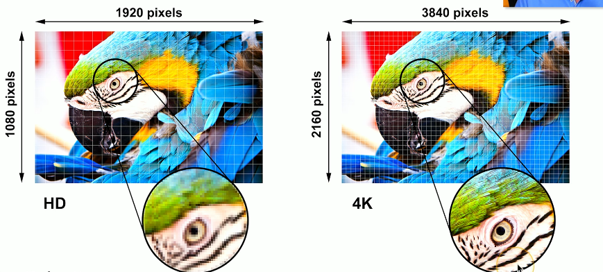

# 3.1 Display Types & Display Attributes

# 3.1.1 Display Types

## LCD (Liquid Crystal Display)

Lights shine through liquid crystals

- Advantages
    - Lightweight
    - Relatively low power
    - Relatively inexpensive
- Disadvantages
    - Black levels are a challenge
    - Requires separate backlight
        - Florescent (old), LED (Light Emitting Diode)
        - Lights can be difficult to replace

### LCD technologies

1.  TN (Twisted Nematic) LCD
    
    - The original LCD technology (the very first)
    - Fast response time (good for gaming)
    - Poor viewing angles - color shifts
2.  IPS (In Plane Switching) LCD
    
    - Excellent color representation
    - Can be more expensive to produce than TN
3.  VA (Vertical Alignment) LCD
    
    - A good compromise between TN and IPS
    - Good color representation
    - Often slower response times than TN

## OLED (Organic Light Emitting Diode) display

- OLED displays do not have a backlight
- OLED displays have a organic compound that emits light when receiving an electric charge
- Thinner and lighter
- Flexible and mobile - no glass needed
- Great for tablets phones and smart watches
- Very accurate color representation
- Tends to be a bit higher cost than LCD

## Mini LED

Mini LED is a type of LCD display that uses thousands of very small LEDs as an advanced backlight system.

- Each LED can be enabled or disabled
- color and intensity can be different
- much better color over dark screen areas
- deeper blacks better color representation  
    

## Digitizers and Touchscreens

### 🔹 **Broad (general) definition**

- A **digitizer** is *any device* that converts **analog (real-world, continuous) information** into **digital (discrete, numeric) data** that a computer can process.

Examples of “digitizers” in this general sense:

- 🎤 A **microphone** digitizes sound waves into digital audio.
- 📷 A **camera sensor** digitizes light into digital images.
- 🖋️ A **graphics tablet** digitizes hand movements or pen strokes.
- 📡 A **scanner** digitizes printed images into digital files.
- 🕹️ Even a **Kinect** (as you mentioned earlier!) digitizes 3D motion into digital position data.

### 🔹 **Narrow (touchscreen-specific) definition**

In touchscreen or pen-input contexts, the word *“digitizer”* has a **specialized meaning**:

- It refers specifically to the **touch-sensing layer** of a display or tablet that converts **finger or stylus movement** into **digital coordinates** that the device can process.

That’s how it’s most often used in consumer electronics (phones, tablets, laptops, etc.).

* * *

### 🔹 **Both perspectives**

| Context | What “digitizer” means | Example |
| --- | --- | --- |
| **General (technical)** | Any device that turns analog → digital | Microphone, camera, Kinect |
| **Specific (touchscreens)** | Touch or pen input sensor layer | iPad or Surface digitizer |

## Backlight and inverter

#### Backlight

- LCD displays use backlights such as:
    - florescent
    - LED lights

### Inverter

Fluorescent-backlit LCD displays require an inverter to convert low-voltage DC power into high-voltage AC to operate the CCFLs, whereas modern LED-backlit LCDs don’t need an inverter, as LEDs run directly on low-voltage DC.

## Troubleshooting

- To verify backlight
    
    - look at the screen closely
    - use a flashlight to luminate the screen
    - texture graphics on the screen that are faint indicate a problem with the backlight
- In case of issues we either replace the display or the LCD inverter
    

# 3.1.2 Display Attributes

## Pixel density (PPI or PPcm)

Pixel density is measured in PPI (Pixel Per Inch) or PPcm (Pixel Per Centimeter)

A higher pixel density means a higher clarity and sharpness of the image.

### Printers

For printers there is DPI (Dots per inch) which determines how many dots can be represented on a inch of paper.

To calculate the pixel density we divide the horizontal pixels (only one line not all) to the width of the screen (in inches or in cm).

- Example:
    - 24 inch (wide) 4K display
    - 3840 horizontal pixels / 24 inches = 160 PPI

## Refresh rates

Refresh rate is the number of times per second a display or monitor redraws or updates the image on the screen, measured in Hertz (Hz). A higher refresh rate means the screen updates more frequently, resulting in smoother motion and less flicker.

If a monitor has a refresh rate of 120 Hz that means that the monitor updates it's image 120 times each second.

Higher refresh rate = better picture (but more expensive)

We have to make sure that both the video card and video adapter can support the resolution and the refresh rate we desire.

For example:

- HDMI 2.1 supports 4K at 144Hz
- DisplayPort 2.1 supports dual 4K at 144 Hz

## Resolution

Resolution is the number of distinct pixels a display can show, usually expressed as width × height.

Width = number of pixels horizontally

Height = number of pixels vertically

Higher resolution = more pixels, resulting in sharper and more detailed images

💡 Simple definition:

Resolution = the total number of pixels a display can show, determining image clarity and detail.

Example:

1920×1080 → 1920 pixels wide × 1080 pixels tall (~2.07 million pixels)

3840×2160 → 3840 pixels wide × 2160 pixels tall (~8.3 million pixels, 4K UHD)

## Color gamut

Color gamut for displays refers to the range of colors a display can reproduce compared to the full range of colors visible to the human eye.

It’s the set of all colors a screen is capable of showing.

The standards for color gamut are:

- Standard gamut (typical): sRGB, Rec.709
- Wide gamut (modern/professional): Adobe RGB, DCI-P3, Display P3
- Ultra-wide gamut (future/pro-grade): Rec.2020, ProPhoto RGB

In the picture above we can se the color gamut specification for 2 displays.

OLED displays are better at color gamut (color coverage) than LCD displays.

# 3.2 Network cables, 568A and 568B colors, Optical fiber, Peripheral cables, Video cables, Storage cables, Adapters and Converters, Copper connectors, Fiber connectors

# 3.2.1 Network Cables

## Twisted Pair Copper Cables

- These are cables where there are pairs of two wires with equal and opposite signals that are twisted around each other
- A pair can be either transmitting or receiving and for that pair one cable sends a positive signal while the other sends a negative signal: Transmit +, Transmit - / Receive +, Receive -
- Twisted-pair wires carry the same signal in the same direction — one wire carries the positive version and the other the negative. The receiver measures the difference between them to detect interference.
- In twisted-pair copper cables, the twisted pair wires are twisted a different rates

### Categories for Twisted Pair Copper Cables

#### By Ethernet Standard

- The IEEE 802.3 Ethernet standard determines what cable type, connectors, and electrical characteristics that are needed for a particular Ethernet signal / Ethernet Standard

Examples of ethernet standards and the minimum cable:

- 10BASE-T → Cat3 or better, up to 100 m
- 100BASE-TX → Cat5 or better, up to 100 m
- 1000BASE-T → Cat5e or better, up to 100 m
- 10GBASE-T → Cat6a or better, up to 100 m

#### By shielding

- **Unshielded twisted pair**
    
    - The most common type of twisted pair cabling
    - No additional shielding
- **Shielded twisted pair**
    
    - Additional shielding to protect against shielding
    - Shielding can be done to each individual pair or to the entire cable
    - Requires the cable to be grounded
- **Abbreviations**
    
    - U = Unshielded
    - S = Braided shielding
    - F = Foil shielding
- (Overall cable) / (individual pairs)TP
    
    - On each cable will have a reading that looks like this S/FTP. The first letter tells us the type of shielding for the entire cable. For our example it's Braided shielding. The next 3 letter after the slash tell us the shielding for each individual twisted pair. In our example it's foil shielding. The TP only stands for twisted pair. Other examples: F/UTP, U/STP, S/UTP

## Coaxial cables

- Coaxial - two or more forms share a common axis
- There is a wire conductor / inner conductor and an outer shield to protect the signals that are running on that inner wire conductor.
- RG-6 is a type of coaxial cable commonly used for transmitting cable television and satellite signals

## Direct burial STP (Shielded Twisted Pair) cables

- Direct burial STP cables are made to be buried in the ground.
    - Waterproof
    - filled with gel to repel water
    - conduit may not be needed
    - these are shielded twisted pair which provides grounding, adds strength and protects against signal interference

The ground is sometimes called a drain wire.

Image above shows the structure of a Direct burial STP (Shielded Twisted Pair) cable.

## Plenum / No plenum, and plenum-rated cables

### Plenum / No plenum

In many commercial buildings, the space above a drop ceiling often contains ductwork for air supply and a large open area where return air flows back to the HVAC system. When this open airspace is used for circulating return air, it’s called a plenum space; if it isn’t used for air circulation, it’s considered non-plenum

  
Above is an image of non-plenum space  
  
Above is an image of plenum space

### Plenum-rated cable

- Traditional cable is a Polyvinyl chloride (PVC) coated cable.
    
- Plenum-rated cable / Fire-rated cable has either
    
    - Fluorinated ethylene propylene (FEP) coating
    - Low-smoke polyvinyl chloride (low-smoke PVC)
- Plenum-rated cable / Fire-rated cables are usually less flexible but are functionally the same as the any Twisted Pair Cable.
    

# 3.2.2 568A and 568B Colors

## Structured cabling standards

- International ISO/IEC 11801 cabling standards defines the different classes of networking standards
    
- In the US the Telecommunications Industry Association (TIA) is a standards based organization that has created a standard for installation of telecommunication cables in a commercial building (telecommunications cabling standard) which can be found in the ANSI/TIA-568: commercial building standard.
    
- http://www.tiaonline.org
    
- Inside that standards document is the definition of what wires go on what pins with which connectors when you are using an ethernet network. We refer to this standardization as the T568A color scheme and the T568B color scheme.
    

## T568A and T568B termination

- The T568B standard is the most commonly used standard.
- It is difficult for a company to switch from one standard to another.
- The two standards should never be mixed (a ethernet cable with one T568B end and one T568A end)
- The mixing of the two standards IS NOT a crossover cable
- The color scheme is important

There are scenarios where we need to punch down the cable to a specific connector and in those cases we have written on the connector the exact color scheme we need to follow for a T568A connection or a T568B connection. The image below demonstrates this fact perfectly.

# 3.2.3 Optical fiber

- It is quite difficult to monitor or trap fiber optics signals.
    
- Sometimes the light of a fiver cable is generated with a LED and sometimes with a laser
    

## Multimode fiber

- up to 2 km: used for short range communication
- because short range it's most common to see cheap LED as light source

## Single mode fiber

- up to 100 km: used for long range communication
- because long range it's most common to see lasers as light source

# 3.2.4 Peripheral Cables

## Universal Serial Bus (USB)

### USB versions

- USB 1.1
    
    - Low speed: 1.5 megabits per second, 3 meters long
    - Full speed: 12 megabits per second, 5 meters long
- USB 2.0
    
    - 480 megabits per second, 5 meters
- USB 3.0 - SuperSpeed
    
    - 5 gigabits per second, ~3 meters
    - \-Standard does not specify a cable length
- USB 3.1
    
    - Maximum of 10 gigabits per second
- USB 3.2
    
    - Maximum of 20 gigabits per second

### USB connectors

### USB-C

The USB-C describes the physical connector not the signal that goes trough the cable. Regardless this connector, USB-C, can replace all of the connectors I have mentioned above

## Serial cables (DB-9 and DB-25)

- A serial cable is a cable that follows (uses) an electrical signaling standard / serial communication.
- The most common electrical signaling standards are: RS-232, RS-422, RS-485
- RS stands for Recommended Standard
- The DB-9 and DB-25 are connectors that are usually used in serial cables. Bothe connectors have a "D" shape with 9 or 25 pins respectively. Sometimes the DB-9 connector is called the DE-9
- “These serial cables were widely used in the past for many types of devices. Today, they’re most commonly used to connect to the console (configuration) port of network switches, routers, and other networking equipment.

### Rollover cables

- A rollover cable is a serial cable that is used to connect a computer to a networking device in order to configure that networking device.
    
- A rollover cable's key characteristic is that it has it's pins reversed from one end to another like shown in the picture. (1-8, 2-7, 3-6, etc.)  
    
    
- A common shape (configuration) of the rollover cable is to have a female DB-9 connector on one end and a RJ45 connector on the other end. However, this configuration is not set in stone and you can have all sorts of connectors for a rollover cable such as: DB-9 to DB-9, RJ45 to RJ45, RJ45 to USB A, etc. You can see some examples in the pictures below  
      
      
    
    
- If the configuration of a rollover cable is DB-9 female to RJ45 than a USB A to DB-9 male adapter is used in order to make the connection to the computer. Like shown in the picture  
    
    
- ATTENTION! It is important to note that when a colleague says: Give me the DB-9 cable or the RS-232 cable it is probably referring to the rollover cable that has a DB-9 connector with a RS-232 signal.
    

## Thunderbolt

High-speed serial connector

- Data and power on the same cable
- Based on Mini DisplayPort (MDP) standard
- Thunderbolt 1
    - Two channels
    - 10 Gbit/s per channel
    - 20 Gbit/s total throughput
    - Mini DisplayPort connector
- Thunderbolt 2
    - 20 Gbit/s aggregated channels
    - Mini DisplayPort connector  
        
- Thunderbolt 3
    - 40 Gbit/s aggregated throughput
    - USB-C connector
    - Maximum 3 meters (copper)
    - 60 meters (optical)  
        \-Daisy-chain up to 6 devices
- Thunderbolt 4
    - Still 40 Gbit/s aggregated throughput
    - Support for dual 4K displays
    - Increased PCle bandwidth
    - USB-C connector

# 3.2.5 Video cables

## HDMI (High-Definition Multimedia Interface)

- Sends both video and audio
- 20 meter max range
- all digital, no analog
- 19-pin (Type A) connector: one of the most common video connector types for HDMI

## DisplayPort

- Sends both video and audio
- Digital information is sent in a packetized form just like ethernet and PCI express
- DisplayPort is compatible with HDMI and DVI. A passive adapter can be used in order to make a connection of DisplayPort → HDMI, DisplayPort → DVI
- A full size display port may have a locking mechanism

## DVI (Digital Visual Interface)

## VGA (Video Graphics Array)

- DB-15 / DE-15 connector
- Blue color (PC system design guide)
- Video only (no audio)
- Analog signal (no digital)
- maximum length of 5 to 10 meters

## USB-C

USB-C is a connector not a protocol

Many uses for USB-C

- Power
- USB data
- Thunderbolt data
- DisplayPort video
- HDMI video (not common)
- Mobile High-Definition Link (MHL)

# Storage Cables

## SATA (Serial AT Attachment)

- SATA Revision 1.0
    - SATA 1.5 Gbit/s, 1 meter
- SATA Revision 2.0
    - SATA 3.0 Gbit/s, 1 meter
- SATA Revision 3.0
    - SATA 6.0 Gbit/s, 1 meter
- SATA Revision 3.2
    - SATA 16 Gbit/s, 1 meter
- eSATA (external SATA)
    - Matches the SATA version
    - 2 meters

The 15 pins are for power while the 7 pins are for data

We have one SATA cable for power and one SATA cable for data. The picture below shows this fact

SATA does not support daisy chaining

## eSATA cable

eSATA (External Serial ATA) is the official extension of the SATA standard — designed specifically for connecting external storage devices (like HDDs and SSDs) to a computer.

It has a special connector called an eSATA connector

# 3.2.6 Adapters and Converters

## DVI (DVI-D) to HDMI

The last "D" of "DVI-D" stands for digital

- DVI-D and HDMI are electrically compatible
    - HDMI is backward-compatible with DVI-D
    - No signal conversion required
    - No loss of video quality

## DVI (DVI-A) and VGA

The last "A" in "DVI-A" stands for analog

- DVI-A includes analog signals
    
    - Both VGA and DVI-A are analog so they are backward compatible
    - Only 640 x 480 is officially supported
- For DVI-A to VGA you only need an adapter as they are both analog
    
- For VGA to DVI-D you need a converter as DVI-D is digital
    
    - Check your interface specifications

## USB to Ethernet

## USB-C to USB-A

## Port replicator / USB hub

A device that connects to your computer via USB-A or USB-C than offers multiple ports to connect many different devices

# 3.2.7 Copper Connectors

# RJ11 / RJ14

RJ 11/14= Registered Jack 11/14

- 6 position, 2 conductor (6P2C)
- Sometimes these cables have 4 wires / 4 conductors (6P4C) which technically makes them RJ14 but we call them all RJ11
- Used for analog telephone connection or DSL (Digital Subscriber Line) connection

  
Image above is a RJ11

Image above is RJ14

Image above shows the difference between the two. But again don't bother with that as both RJ11 and RJ14 are called RJ11

## RJ45

RJ 45= Registered Jack 45

- 8 position, 8 conductor (8P8C)
    - Also referred to as **modular connector**
    - Also referred to as **ethernet connector**

  
The image above shows the size diffrence between RJ11 and RJ45

## F-connector

- The F-connector is the connector used for Coax cables

## Punch Down block (110 block or 66 block)

## USB 1.1/2.0 connectors

## USB 3.0 connectors

## USB-C connector

## Molex connector

- Also called AMP Mate-n-Lok
- Provides 12 V and 5 V
- Usually provides power for fans and storage drives

Some older power supplies offer Molex connectors

## Lightning connector

- It's an Apple proprietary connector used for some of the older versions of iPhone, iPad, iPod

## DB-9

Console/configuration port on a switch

# 3.2.8 Fiber Connectors

## Straight Tip - ST

- Bayonet connector
    - To connect it you need to push it and twist it to lock it in place

## Subscriber Connector / Square Connector / Standard Connector - SC

These connectors are just push and pull no twist lock, however, we must make sure to push and pull the cable from the square plastic head not the fiber cable itself.

These cables can be used separately or attached together as a pair

## LC - Lucent Connector

- smaller more compact connector
- has a clip to lock it in place
- Other names:
    - Local Connector
    - Little Connector

Like with square connectors Lucent connectors can be attached together

## All connectors together

# 3.3 An Overview of Memory, Memory Technologies

# 3.3.1 An Overview of Memory

## RAM (random access memory)

It is the working memory of the computer not the long term storage of the computer.

### DIMM (Dual inline memory module)

It has this name because the DIMM ram has two sides with different electrical contacts.

- 64 bit data width

### SO-DIMM (Small Outline Dual In-line Memory Module)

This is the memory used for laptops or mobile devices.

### Dynamic Random Access Memory (DRAM)

This is the memory chip on the DIMM

Dynamic → Needs to be refreshed because otherwise data is lost.

Random Access → Can access any memory location directly and instantly (in the context of RAM speed)

### Synchronous DRAM (SDRAM)

SDRAM is synchronized to the system’s main clock, which controls the timing of data transfers inside the computer.  
This common clock ensures that components operate in sync, allowing data to move back and forth at a consistent, predictable rate.

Classic DRAM didn't wait for a clock signal

### SDR vs DDR

SDR is “old-school” synchronous RAM, moving data once per clock cycle. DDR is the improved version, moving data twice per cycle, giving much higher bandwidth without increasing clock speed.

The image above shows how in one clock cycle, DDR delivers double the data.

## DDR2 SDRAM, DDR3 SDRAM, DDR4 SDRAM, DDR5 SDRAM

DDR2 < DDR3 < DDR4 < DDR5. It’s important to note that DDR generations are not backwards compatible. Each type has a different physical layout, which can be identified by the position of the notch (key) at the base of the RAM module.

The picture above shows this the different positions of the notches at the bottom of the RAM module

# 3.3.2 Memory Technologies

## Memory that checks itself

These types of memory modules are used in any type of server

### 1\. Parity memory (RAM)

- Parity memory adds a parity bit to each byte to detect errors.
    
- Parity memory can detect errors but cannot correct them.
    
- Parity memory cannot detect all types of errors, especially dual-bit errors.
    
- Parity memory has largely been replaced by ECC memory.
    

### 2\. ECC memory (RAM)

- ECC = Error-Correcting Code
    
- ECC memory adds 8 redundant bits for every 64 bits of data to allow single-bit error correction (SEC) and double-bit error detection (DED).
    
- ECC memory detects and corrects errors , usually single-bit errors, and can detect some multi-bit errors.
    
- ECC RAM is extremely important in high-data throughput servers, where data integrity and uptime are critical.
    
- Modules for parity memory and ECC memory may look similar, so you must check the specifications to see whether a module is ECC or parity.
    
- ECC protects only memory subsystem errors, not CPU errors or software bugs.
    

### 3\. RDIMM

RDIMM = Registered DIMM (NOT Rambus DIMM — that’s RIMM). RDIMM uses a register (buffer) between the memory modules and the memory controller.

RDIMMs buffer command/address signals, which reduces electrical load, allowing more memory modules to be installed while maintaining stability.

RDIMMs are typically used in servers and workstations, not standard desktop motherboards.

RDIMM modules often support ECC, but being RDIMM does not automatically mean ECC — ECC is a separate feature. Most server RDIMMs are ECC, but it’s not a strict rule.

Using RDIMMs allows higher memory capacities and improved reliability, especially in multi-channel or multi-CPU server configurations.

## How a parity bit works & How a parity check is performed

For parity memory, the bits of a byte are summed, and if the total number of 1s is even, the parity bit is set to 0; if the total number of 1s is odd, the parity bit is set to When performing a parity check (error check), the computer sums the bits again (including the parity bit) and checks whether the total is even or odd. If the result matches the expected parity (even or odd), the data is considered correct; if not, an error is detected.

## CPU to RAM throughput (memory bandwidth)

The maximum rate (throughput) at which data can be transferred between the CPU and RAM is called the memory bandwidth.

Clarification:

Bandwidth – max possible data rate. (Mbps, GB/s)  
Throughput – actual data rate achieved. (Mbps, GB/s)  
Latency – time delay for data to travel. (ms)

- This data transfer rate is measured in MT/s. MT stands for **Megatransfers**
    - Megatransfers/s = Million transfers per second
    - e.g. 32 GB DDR5, 1X32GB, 5600 MT/s
    - Faster is better and the memory bandwidth of a RAM module is an important characteristics

## Multi-channel memory

Multi-channel memory is a configuration where the memory controller accesses two or more memory modules simultaneously, effectively increasing the data transfer rate between RAM and CPU. It improves memory bandwidth without increasing individual module speed.

Example: Dual-channel uses two modules at once; quad-channel uses four.

The motherboard determines if the computer can support multi-channel memory or not.

Usually motherboards color their RAM slots such that it's evident what slot is for what channel.

# 3.4 Storage Devices, RAID

# 3.4.1 Storage Devices

Just like the brain has short-term and long-term memory, a computer has similar concepts. The short-term memory of a computer is RAM (often referd to as "memory"), which stores data temporarily for quick access by the CPU. The long-term memory is storage (like SSDs or hard drives), which retains data even when the computer is powered off.

## Volatile vs Non-Volatile Memory:\*\*

- **RAM** is volatile; data is lost when the computer is powered off.
- **Storage devices** provide non-volatile memory to retain data long-term. Examples include HDDs, SSDs, flash drives, memory cards, and optical drives.

## Hard Disk Drives (HDD):

- Magnetic storage with spinning platters, actuator arm, and read/write head.
- Access is random; speed depends on **spindle RPM** (common: 5,400–15,000 RPM); higher spindle RPM means less latency but more noise
- Form factors: 3.5-inch (desktops) and 2.5-inch (laptops).
- Mechanical parts make HDDs prone to failure.

## Serial Attached SCSI (SAS drive):

- High-speed interface for enterprise HDDs (up to ~22.5 Gbps), faster than SATA.

## Solid-State Drives (SSD):

- Use **non-volatile memory** with no moving parts → faster read/write speeds.
- SSD's are faster than HDD's
- Early SSDs used

### PCIe storage interface, M.2 Storage, mSATA storage, NVMe protocol, SATA/AHCI protocol

- Early SSD's used **SATA/AHCI** protocol and interface standard to connect storage devices (HDDs or SSDs) via the SATA bus (up to 6 Gbps) which were better than traditional HDD's but still limiting.
- Now, modern SSD's use **NVMe** protocol over PCIe (NVMe over PCIe) for much higher throughput and lower latency (up to 20 Gbps).
- A NVMe over PCIe SSD is connected via a expansion card or directly to motherboards that have dedicated slots
- Common form factor: **M.2**, with keys (B, M, or B+M) affecting compatibility. These M.2 keys are often called interfaces. For some motherboards the keys determine the throughput of the card. (Check the documentation to see the key supported)

mSATA (Mini-SATA) was a intermediary point between 2.5'' SATA drive and the M.2 standard. It was used briefly before being replaced by M.2

- SATA drives (3.5″ HDDs, 2.5″ SSDs, and mSATA SSDs) use the SATA/AHCI protocol.
    
- M.2 drives can use either SATA/AHCI or NVMe/PCIe, depending on the specific drive:
    
    - M.2 SATA SSDs → SATA/AHCI protocol (speed limited by SATA, ~6 Gbps)
    - M.2 NVMe SSDs → NVMe protocol over PCIe (20 Gbps, lower latency)

## Flash Drives:

- Small, portable storage using **EEPROM/flash memory**. EEPROM = Electrically Erasable Programmable Read-Only Memory
- Limited write cycles; not ideal for archival storage (always have a backup).
- Formats include USB drives, SD (Secure Digital) cards, Compact Flash (CF), miniSD, microSD, xD-Picture Card.

## Optical Drives:

- Store data with lasers on discs (CD, DVD, Blu-ray).
- Slower than HDDs/SSDs; mostly used for archiving or older data.

# 3.4.2 RAID

## **RAID Overview**

- **RAID = Redundant Array of Independent/Inexpensive Disks**.
- Combines multiple drives to **increase redundancy, performance, or both**.
- **RAID is not a backup**—separate backups are still necessary.

## **RAID Levels**

1.  **RAID 0 (Striping)**
    
    - Splits data across multiple drives for **speed**.
    - **No redundancy**; losing one drive = losing all data.
    - Requires at least 2 drives.

2.  **RAID 1 (Mirroring)**
    
    - Duplicates data across drives for **redundancy**.
    - Can survive a single drive failure.
    - Requires at least 2 drives; storage capacity is halved.

	
3.  **RAID 5 (Striping with Parity)**
    
    - Splits data across drives + stores **parity** for recovery.
    - Can survive **one drive failure**.
    - More storage-efficient than RAID 1.
    - Parity distributed across drives; some CPU overhead for recovery.

4.  **RAID 6**    
    - Like RAID 5 but with **two parity blocks**.
    - Can survive **two drive failures**.
    - Requires extra drive(s) for additional parity; storage capacity reduced.

5.  **RAID 10 (1+0, Mirror + Stripe)**
    
    - Combines **RAID 0 striping** with **RAID 1 mirroring**.
    - Can survive multiple drive failures depending on which drives fail.
    - Requires at least 4 drives; provides **speed + redundancy**.

  

### **Key Concepts**

- **Striping** = splitting data across multiple drives for speed.
- **Mirroring** = duplicating data for redundancy.
- **Parity** = calculated data that allows recovery of lost information.
- RAID increases **fault tolerance** but **does not replace backups**.

* * *

If you want, I can make an **even shorter, one-page “cheat sheet” of RAID levels with pros, cons, and required drives** for quick reference.

# 3.5 Motherboards, Motherboards Expansion Slots, Motherboard Connections, Motherboard Compatibility, The BIOS, BIOS settings, HSM & TPM, CPU Features, Expansion Cards, Cooling

# 3.5.1 Motherboards

Before buying and installing a motherboard must take into account the following aspects.

- Physical size
	- Case sizing
- Basic layout
	- Room for small changes
- Power
	- Standard power connectors
	- Non-Standard power connectors
- Airflow
	- Increasingly important, as all computer hardware generates heat

Unfortunetly wikipedia shows us that there are 40 different motherboard types categorized! For the ComTIA A+ we don't need to learn them all.

## Motherboard form factors

The “ATX family” defines motherboard **dimensions** and **mounting hole positions**:

* **E-ATX** → Largest (used for workstations, multiple GPUs).
* **ATX** → Standard desktop size.
* **Micro-ATX** → Smaller, fewer slots.
* **Mini-ITX** → Tiny, only one PCIe slot.
*  **Nano-ITX**
*  **Pico-ITX**
  👉 Those “Nano” and “Pico” ATX forms exist, but they’re niche/industrial and not part of the mainstream ATX standard.

**THE MOST IMPORTANT TO REMEMBER ARE: ATX, Micro-ATX, Mini-ITX**

### ATX form factor

ATX = Advanced Technology Extended

Standardized by Intel in 1995, and while there have been alot of changes one of the most important ones is regarding power.

- Power
	- 20-pin power connector (old motherboards)
	- 24-pins power connector +  4 pin or 8 pin power connectors for the CPU (new motherboards)

 
### microATX (uATX, M-ATX)

- Smaller than an ATX motherboard
	- Limited expansion slots

 - Similar to ATX, micro ATX has
	 - the same or very similar mounting points
	 - the same or very similar power (24 pins or 20 pins)
- It is a popular form factor because it respects the same standards as ATX but at a smaller size (actively manufactured as of 2019)

 ### ITX form factor

Very small form factor developed in 2001 by VIA Technologies

Mini-ITX has the same mounting points as ATX

# 3.5.2 Motherboard Expansion Slots

⚠️ **Warning:**
In this text, we’ll use the term *bus* to describe how components communicate on a motherboard. In this subchapter, bus will specifically mean a connection between two or more computer components. However, it’s important to understand that **modern systems no longer rely on shared buses for major component communication**. Instead, **most modern motherboards use high-speed, point-to-point links** (like PCIe, DMI, or dedicated memory channels) to connect the CPU, GPU, RAM, and chipset directly. The term *bus* remains mostly for **conceptual or historical clarity**. (For clarification google bus network topology to see what a shared bus looks like)

As a general rule, each major non-CPU component (RAM, GPU, NIC, etc.) has a dedicated point-to-point link which goes directly to the CPU. Any data transfer or communication between non-CPU components is don through the CPU.

