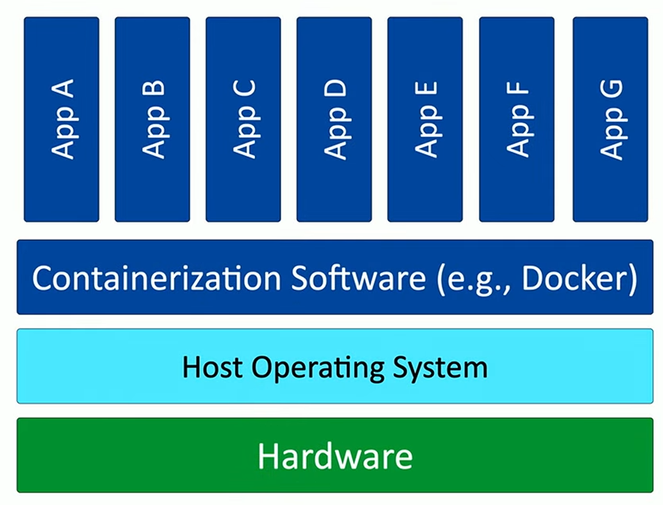
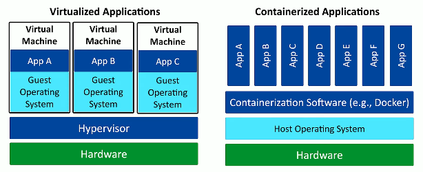
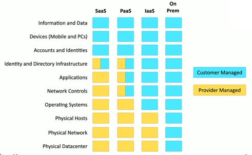

# 4.1 Virtualization Concepts, Virtualization Services

# 4.1.1 Virtualization Concepts

## Virtualization Overview

Virtualization allows a single physical machine to run **multiple operating systems simultaneously**. For example, a Mac system could run **macOS, Windows 11, and Linux** at the same time. Each virtualized OS has its own **dedicated resources** — CPU, memory, and network interfaces — while all share the same underlying hardware. This setup is known as **host-based virtualization** when running on a desktop OS.

In enterprise environments, virtualization usually runs without a desktop interface — a **bare-metal hypervisor** hosts multiple **virtual machines (VMs)** directly on a single server. Despite its modern popularity, this concept dates back to **IBM mainframes in 1967**, where the groundwork for today’s virtualization was first laid.

## Sandboxing and Snapshots

A major advantage of virtualization is **sandboxing**, which isolates a virtual machine from the host system. Developers use sandboxed VMs to **test applications, run experiments, and evaluate system behavior** without risking damage to the host or other environments.

Another key feature is **snapshotting** — the ability to capture a VM’s exact state at a specific moment. If changes or updates cause problems, you can **revert to a previous snapshot instantly**, restoring the VM to a known good state. This makes virtualization ideal for **testing, debugging, and controlled experimentation**.

## Cross-Platform Testing and Development

Virtualization makes it possible to run **multiple operating systems simultaneously** for compatibility testing or cross-platform development. A developer can, for example, run **Windows 11, Windows 10, and Linux** side by side, switching between them instantly. This allows testing applications across different systems without rebooting or setting up separate hardware.

This flexibility enables developers to create, test, and refine software in **environments that closely mirror production systems**, ensuring consistency between development and deployment.

## Supporting Legacy or Specialized Software

Virtualization is also valuable for running **older or specialized applications** that require legacy operating systems. For instance, a Windows 11 machine can host a **Windows 10 virtual machine** to support older software that doesn’t run properly on the newer OS. Users can toggle between environments seamlessly, maintaining access to all necessary tools and applications.

## Cross-Platform Virtualization

Modern virtualization isn’t limited to a single OS family. It supports **cross-platform environments** — for example, running **Windows and Linux VMs on a macOS host**. Users can simultaneously operate different OS-specific applications side by side: a macOS browser, Windows productivity tools, and Linux utilities — all in separate windows.

This provides **on-demand access** to whatever software or operating system is needed without rebooting or switching devices. The result is **greater efficiency**, **resource savings**, and **complete flexibility** in how systems and applications are managed and used.

# 4.1.2 Virtualization Services

## The Role of the Hypervisor

To run multiple virtual machines (VMs) effectively, you need a **Virtual Machine Manager**, more commonly known as a **hypervisor**. The hypervisor acts as the **control layer between the physical hardware and virtual environments**, managing how CPU cycles, memory, and networking are divided among each VM. Modern CPUs often include **hardware support for virtualization**—Intel’s **VT (Virtualization Technology)** and AMD’s **AMD-V**—to improve performance and efficiency.

A typical virtualization stack begins with the **hardware at the base**, the **hypervisor above it**, and multiple **guest operating systems** on top. Each VM has its own OS, applications, and data, which increases **overhead**—requiring sufficient **CPU, RAM, and disk space** to support them all simultaneously.

## Type 1 and Type 2 Hypervisors

There are two main hypervisor types:

* **Type 1 (Bare-Metal)** – Runs **directly on the hardware** without a host OS. The hypervisor itself acts as the primary system. Examples: **VMware ESXi** and **Microsoft Hyper-V**.
* **Type 2 (Hosted)** – Runs **on top of an existing operating system**. Common on desktops, it allows users to virtualize systems within Windows, macOS, or Linux. Examples: **VMware Workstation**, **VirtualBox**, and **Parallels Desktop**.

The VMs themselves function the same way under both types—the only difference is **how the hypervisor is deployed**.

## Resource Allocation and Networking

The hypervisor manages **resource distribution** among all virtual machines, ensuring each has dedicated processing, memory, and storage. Since each VM is a complete system, you need enough **RAM** and **disk space** for multiple OS installations and applications.

Hypervisors also handle **virtual networking**. They can:

* **Isolate VMs internally** (private networking),
* **Share the host’s connection using NAT**, or
* **Bridge** the VM directly to the local network so it appears as a separate device.

- Shared network address (NAT)
	- The virtual machine shares the same IP address as the physical host
	- Uses a private IP address internally
	- Uses NAT to convert to the physical host IP 
- Bridged network address
	- The VM is a device on the physical network
- Private address
	- The VM does not communicate
outside of the virtual network

This flexibility allows for highly customized configurations depending on the use case and security needs.

## Virtualization Security

Security is a critical concern in virtualization. Although **major hypervisor breaches are rare**, developers focus heavily on preventing vulnerabilities like **VM escape**, where malware inside one VM could exploit the hypervisor to reach others.

Each VM should be **secured like a standalone system**—with firewalls, anti-malware protection, and OS hardening. Additionally, avoid running **downloaded or unverified virtual machines**, as malicious actors sometimes distribute **infected pre-built VMs** online. It’s always safer to **build your own virtual machines** or obtain them from trusted sources.

## Virtual Desktop Infrastructure (VDI)

VDI = remote computers (virtual desktops) running on a server that people connect to instead of using their own PCs.

**Virtual Desktop Infrastructure (VDI)**, also known as **Desktop as a Service (DaaS)**, virtualizes the **entire desktop environment** instead of just individual applications. The user’s desktop runs as a **virtual machine on a remote server or cloud system**, while the local device acts only as a terminal with a keyboard, mouse, and display.

VDI reduces the need for powerful local hardware—since the processing occurs remotely—and provides centralized management, easier updates, and secure access over the network. From the user’s perspective, it functions just like a standard local operating system.

## Application Containerization

While virtualization duplicates entire operating systems, **containerization** only isolates **applications**. Each container includes everything needed to run that app but **shares the host operating system**, making containers **lighter, faster, and more portable** than full VMs.

For example, using **Docker**, multiple containers can run on a single OS, each isolated from the others. Containers can be quickly deployed, transferred, or scaled across systems.

The trade-off is that containers depend on the **same host OS type**—you can’t mix Windows, Linux, and macOS containers on the same Docker instance. By contrast, virtual machines can run completely different OSes simultaneously but at the cost of **greater resource overhead**.

Containerization therefore emphasizes **efficiency and speed**, while full virtualization prioritizes **flexibility and OS independence**.

# 4.2 Clound Models, Cloud Characteristics

# 4.2.1 Cloud Models

## Cloud Computing Overview

Cloud computing is more than just hosting a server elsewhere. It provides on-demand access to computational resources—CPU, storage, and networking—globally. It allows rapid deployment of applications anywhere in the world and can scale resources up or down based on demand, offering efficiency and financial flexibility.

## Public Cloud

Public cloud refers to cloud infrastructure provided by external providers such as Microsoft, Amazon, and Rackspace. These services are accessible from anywhere over the internet, however you can deploy an app to where it makes the most sens. If you want to deploy an app in Europe you may want to use a cloud/server from Europe. Users benefit from large-scale resources and quick deployment but have less control over underlying infrastructure.

## Private Cloud

A private cloud is hosted on an organization’s own data center. It requires purchasing hardware and storage upfront but provides complete control over data, infrastructure, and applications. Private clouds are typically used for internal applications that require high security and compliance.

## Hybrid and Shared Clouds

Organizations often use a mix of public and private clouds (hybrid) to balance control, cost, and performance. Smaller organizations may participate in shared clouds to access cloud services collectively without bearing full infrastructure costs.

## Infrastructure as a Service (IaaS) / Hardware as a Service (Haas)

IaaS provides virtualized computing resources over the internet. The cloud provider manages the physical hardware and network, while the customer is responsible for installing and maintaining the operating system, applications, and security. It offers flexibility but comes with significant management overhead.

*Example:* Renting a VM and installing your own OS and software, to run a web service.

IaaS: You only get the playground but you choose the tools you want and build everything yourself.

## Software as a Service (SaaS)

SaaS provides fully managed applications accessible over the internet, requiring only user credentials. The provider handles everything from infrastructure to software updates. This reduces management overhead but limits control.
*Example:* Gmail or Microsoft 365.

SaaS: Everything’s pre-built for you, and ready for use

## Platform as a Service (PaaS)

PaaS provides a platform for building and running applications without managing the underlying OS, runtime, or infrastructure. The customer focuses on application development, while the provider handles the platform and environment. It’s a hybrid model between SaaS and IaaS.

*Example:* Salesforce’s development platform for custom apps.

PaaS: You get the playground + approved tools then you build within those limits.

## **Responsibility in the Cloud**

Cloud providers often supply a responsibility matrix to clarify which aspects of the cloud environment are managed by them versus the customer. Responsibilities vary by deployment model:

* **IaaS:** Customer handles OS, applications, data, security.
* **PaaS:** Customer develops applications; provider manages platform.
* **SaaS:** Provider manages infrastructure and software; customer handles users and accounts.

If your are building your own cloud services, everything is your responsibility.

---

### **Summary Table of Cloud Models**

| Cloud Model | Customer Responsibility          | Provider Responsibility               | Key Example                     |
| ----------- | -------------------------------- | ------------------------------------- | ------------------------------- |
| IaaS        | OS, applications, data, security | Hardware, network                     | Renting a cloud VM              |
| PaaS        | Application development          | Platform, OS, runtime, infrastructure | Salesforce development platform |
| SaaS        | User accounts, identity          | Everything else                       | Gmail, Microsoft 365            |

---
# 4.2.2 Cloud Characteristics

## Private Cloud

A private cloud is owned and managed by a single organization within its own data center. The organization purchases and maintains all hardware, storage, and infrastructure. Resources are dedicated solely to that organization, giving complete control and eliminating recurring pay-as-you-go costs. The main drawback is the significant upfront investment required.

## Public Cloud

Public clouds are hosted by third-party providers like Amazon, Microsoft, or Rackspace. Multiple customers share the same physical resources (CPU, storage, network), but data is isolated between tenants. Public clouds reduce upfront costs but involve ongoing metered or fixed pricing depending on usage.

## Cloud Billing Models

Cloud costs can vary:

* **Metered utilization:** Costs based on actual usage (CPU, storage, network traffic). Busy months cost more; slower months cost less.
* **Fixed pricing:** A set cost for a predefined amount of resources, common in consumer cloud services.

Cloud traffic is often categorized as:

* **Ingress traffic:** Data uploaded into the cloud.
* **Egress traffic:** Data downloaded or sent out of the cloud.

---

## Elasticity and Scaling

Cloud services allow dynamic scaling of infrastructure to meet changing demands. Organizations can scale up during high activity periods and scale down when demand is low, optimizing costs and resource usage. This on-demand flexibility is referred to as **elasticity**.

## Availability and Redundancy

Cloud infrastructure is designed for high uptime. Redundancies across multiple data centers ensure continuous availability even if one data center experiences hardware or network failures. Extreme cases involve migrating services between data centers to maintain operations.

## Global Presence (File synchronization)

Cloud services can maintain data across multiple geographic locations. This ensures that users can access services efficiently and that data can be synchronized automatically between data centers for reliability and performance.

## Multi-Tenancy

Public cloud efficiency relies on **multi-tenancy**, where multiple customers share the same physical infrastructure. While resources are shared, proper isolation mechanisms ensure that each tenant’s data and operations remain separate. Multi-tenancy improves resource efficiency and reduces overall costs.

---

### Summary Table of Cloud Characteristics

| Feature             | Private Cloud                               | Public Cloud                                | Notes                                                    |
| ------------------- | ------------------------------------------- | ------------------------------------------- | -------------------------------------------------------- |
| Ownership           | Organization owns & manages                 | Third-party provider                        | Private = full control; Public = shared resources        |
| Cost Model          | Upfront investment, no recurring cloud fees | Metered or fixed pricing                    | Public cloud can scale costs with usage                  |
| Resource Allocation | Dedicated                                   | Shared (multi-tenant)                       | Isolation ensures security                               |
| Scalability         | Limited by own resources                    | Elastic, on-demand                          | Public cloud supports automatic scaling                  |
| Availability        | Depends on org’s redundancy                 | High, built-in redundancy & global presence | Public cloud offers failover and geographic distribution |
| Control             | Full                                        | Partial                                     | Private cloud allows custom configurations               |

