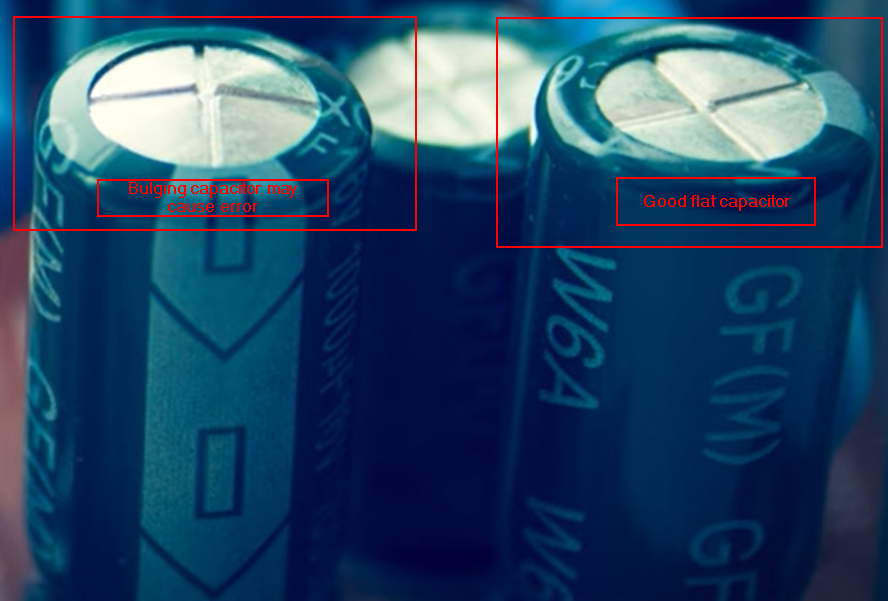
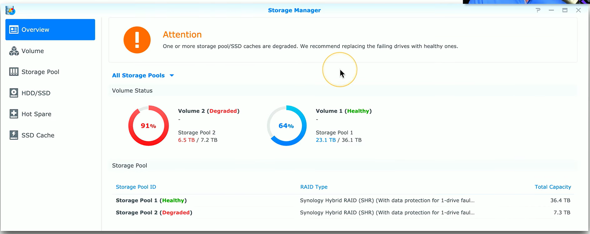
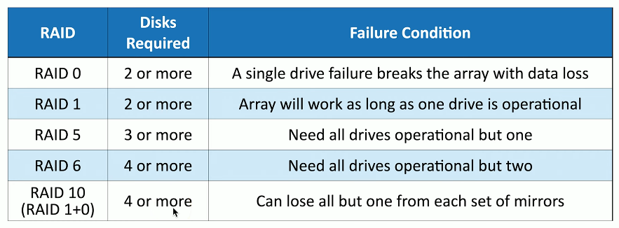
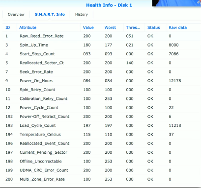
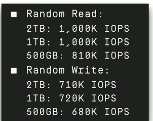
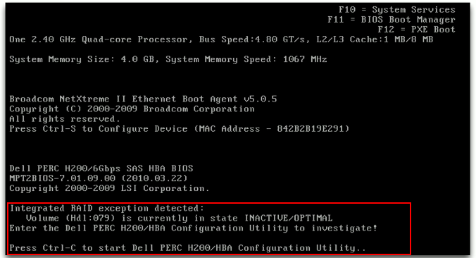
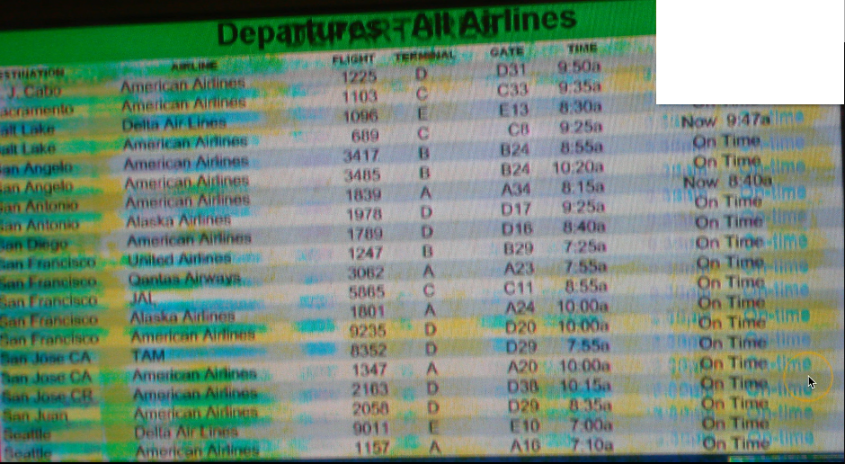
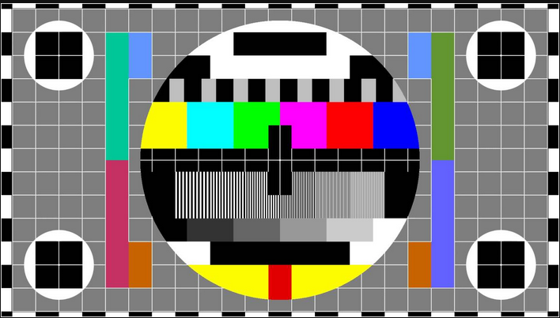

# 5.1 Troubleshooting Hardware

## POST (Power-On Self-Test)

When a computer powers on, it runs a POST to check core components like the CPU, memory, video subsystem, and BIOS communication. Errors may produce beep codes and on-screen messages, which vary by manufacturer. Beep codes indicate hardware issues, but referencing documentation is necessary for precise troubleshooting.

The real key is understanding what that beep code means and what you should do next.
And if you are getting beep codes, there should be messages on the screen if there's no problems with your video display.
And certainly, there will be a series of codes, probably long and short codes, that you'll need to reference.
You'll need to look at the error codes on your screen and reference how many beeps you're hearing in this beep code against the manufacturer's documentation.

If you turn on your computer and start hearing beeping noises but you see nothing on the screen, then your problem is probably related to bad video on the motherboard, although it could be related to bad memory or bad CPU.

This could also be a misconfiguration with the video subsystem inside your BIOS.
So you want to look at the BIOS configuration and confirm that everything in the BIOS looks to be in order.

If you're powering up and you get a message that the bios time and date is incorrect, then it's very possible your problem is with the battery that's on the motherboard.
One of the few reasons we still have a battery on the motherboard is to maintain the date and time, especially if there's no power source to the computer.
If your battery has failed, you'll be prompted to input the date and the time each time you plug in that computer and start it back up again.

Your bios might give you the option to check that there is actually media plugged in to that particular startup device.
If there's nothing physically connected to those USB interfaces, then your bios will decide to go to the next device on its list of boot devices. 

## BIOS Configuration and Battery

BIOS settings control boot order and hardware initialization. A failing motherboard battery can reset the system clock, requiring date and time input on each startup. Replacing the battery resolves this. BIOS also allows prioritizing boot devices, ensuring the operating system starts from the intended drive.

---

## Blue Screen of Death (BSOD) / Windows Stop errors

Windows stop errors occur when the OS cannot recover from a critical issue. The BSOD provides error codes, stop codes, and driver names to help troubleshoot. Recovery options include safe mode, last known good configuration, system restore, or driver rollback. Hardware issues may require reseating components or running diagnostics.

BSOD occurs in the case of bad hardware, bad drivers, bad application.

- BSOD from bad application fix
	- If this is something that just started after making a change or installing a new application, you might be able to use the option during startup to use the last known good configuration, run a system restore to move back to a particular date and time, or roll back the driver that you most recently installed. If you're getting this blue screen problem when you're starting your computer, you might want to try starting in safe mode to see if that can circumvent the issue.

- BSOD from bad drivers
	- If you believe that this problem is related to the drivers on your computer, you may want to try taking out the adapter cards and reseeding them or removing the memory modules and putting those back just to make sure that everything has a good connection.

- BSOD from bad hardware
	- And if you've checked everything else and you think this may be related to the hardware of your system, this might be a good idea to run a full hardware diagnostics.
These are usually provided by the motherboard manufacturer or the hardware manufacturer of the components within your system, and the BIOS that you have on your computer itself may have built in diagnostics that you can use.
You usually have the option to choose exactly which components you'd like to test, and whether the test should be quick or something that you might want to run overnight.  

## Application Crashes and Error Messages

Applications may crash with explicit messages or disappear without warning. Event Viewer, reliability monitor, and application logs help track and troubleshoot failures. Screenshots of error messages are valuable when contacting the software manufacturer. Reinstalling applications can resolve installation-related issues.

Sometimes messages are very informative and tell you exactly how to solve the problem other times they aren't. Either way you, as the technician, need to make sure that you document as much of this information as possible, beacause you may not know what all this means but the manufacturer of the app may know and giving him such detail may help him solve this issue much faster. One of the best things you can do is to get a screenshot or take a picture of the error so that you can provide that to the manufacturer. 

**If you're working on a help desk, it might be useful to ask users proactively to add a screenshot as they're documenting the information for this ticket.**

## Black Screen and Video Issues

Black screens can result from disconnected cables such as the video cable and the power cable of the monitor, wrong monitor input selection such as the monitor being on DVI-A rather than HDMI, video configuration of the monitor: where we have to press the buttons on the monitor , failed monitors, or problems in BIOS or Windows. VGA mode in Windows can force a generic driver to help troubleshoot. We access VGA mode by pressing the F8 key during the boot process choosing VGA mode as your boot option

---

## Power Issues

Lack of power can stem from outlets, power cords, or faulty power supplies. Multimeters help test AC input and DC output. Partial power (e.g., fans spinning but no video) often points to motherboard or voltage issues. For each component that does not get enough power we need to see if the power supply comes from the outlet or the motherboard itself.

Fans spinning but no video => POST error => Video Card bad or Motherboard is bad
Only fans are working => Not enough power from the PSU

---

## System Slowness (Sluggish performance)

Sluggish performance may be caused by high CPU, memory, disk, or network usage. Task Manager can help identify resource-intensive processes. Solutions include Windows updates, checking disk space, defragmentation, adjusting power-saving modes (especially laptops that are not connected to the wall for power), and scanning for malware.

---

## Heat and Cooling

CPUs, GPUs, memory, and other components generate heat. Cooling uses fans and heatsinks; blocked airflow or dust reduces cooling efficiency, causing throttling or shutdowns. If fans or cooling systems are full of dust it's not going to be able to cool anything in your system and so the system will automatically start to decreas CPU usage leading to slugish performance. Monitoring tools (e.g., HW Monitor) track temperatures. Proper thermal paste and fan maintenance are essential.

## Random Shutdowns

When electronic components fail, the failure can sometimes be spectacular.
It's not unusual to see smoke and even smell that something is burning inside of your computer case.
If this happens to your computer, you want to be sure to remove any power source from your computer as soon as possible. After that we can take the computer apart to see the problem.
Sometimes system just turns black, randomly. In those cases, check the hardware, then start the system back up again and if possible, check Event Viewer and see if any messages were written to the event log before the system powered down. Problems like this are often associated with heat issues. The sensors inside the computer know exactly the temperature of the optimal components so if the temperature goes to high it automatically shuts down to protect the hardware from damage.
This could also be related to failing hardware in the system, especially if you just added some new components, so check Device Manager on your system and see if anything may have been disabled.

- Troubleshooting resources in the operating system
	-  Event Viewer
	-  Logs for the app
	-  Reliability Monitor
	-  Reinstall the application

Unexpected shutdowns are often heat-related or caused by failing hardware. Event logs can provide clues. Checking fans, airflow, and heatsinks is critical. Reseating memory and expansion cards can help isolate hardware issues.

---

## Noise Diagnostics

Unusual sounds indicate specific hardware issues:

* Rattling: loose heatsinks or components
* Scraping: hard drive problems
* Clicking: obstructed fan
* Popping or smoke: blown capacitor, usually requiring hardware replacement

## Capacitors

Bulging or blown capacitors on motherboards indicate electrical failure and typically require hardware replacement.

---

## Motherboard Battery Maintenance (CMOS Battery)

Replacing button-style motherboard batteries restores date/time functions. Older systems may reset BIOS configurations when the battery is removed; modern systems generally retain settings. Complete BIOS resets may require jumpers rather than battery removal.

# 5.2 Troubleshooting Storage Devices

## Storage Drive Errors

Errors like "cannot read from the source disk" indicate problems reading or writing to a storage device (HDD or SSD). Common symptoms include slow performance and repeated retries, sometimes producing loud clicking noises known as the “click of death” beacause once your hard drive makes those clicking noises it's hard to recover that data. Mechanical drives have spinning platters and actuator arms that can fail, often cascading into further hardware issues. All components are made of metal so metal on metal or griding noises should occur.
Because of these problems it's important to have backups of the data inside of Hard Drives.

## Troubleshooting Storage Drives

Steps for addressing drive issues include:

* Checking for loose or damaged cables
* Check any heat problems
* Verifying power supply adequacy
* Monitoring drive temperatures
* Running manufacturer diagnostics (often overnight) to test all sectors
* Checking BIOS boot order and drive recognition when the device boots up with a bad drive (err mssg: boot device not found)
* Make sure opperating system is on the drive and that the boot sequence is correct
* Make sure cables and connections are good.
* Reseating drives or moving them to another system if needed

## Backup Importance

Because storage devices inevitably fail, maintaining current backups is essential. Attempting data recovery from failed drives without a backup can be difficult, expensive, and sometimes impossible.
For a faild SSD you may not be able to write but you are able to read the data.
**ALWAYS HAVE A BACKUP OF YOUR DATA**

---

## RAID Arrays (RAID failures)

RAID (Redundant Array of Independent Disks) uses multiple drives to improve redundancy and performance. Key points:

* RAID 0 (striping): no redundancy; failure of a single drive results in complete data loss
* RAID 1 (mirroring): requires at least 2 drives; one drive can fail without data loss
* RAID 5: striping with one parity drive; can tolerate one drive failure
* RAID 6: striping with two parity drives; can tolerate two drive failures
* RAID 10: combination of mirroring and striping; can survive multiple drive failures depending on which drives fail

RAID controllers often provide detailed information on drive health, send alerts, and allow replacement of failing drives without interrupting service (depending on RAID type).

Make sure that you are focusing on the correct physical drive that is experiencing these issues. 

Pictures above are of raid controllers

---

## SMART (Self-Monitoring, Analysis and Reporting Technology)

Self-Monitoring, Analysis, and Reporting Technology (SMART) tracks drive performance metrics like:

* Power-On Hours
* Power Cycle Count
* Temperature
* Read/write error rates

Third-party tools can analyze SMART data over time to predict drive failure and prompt proactive replacement before catastrophic failure occurs.

Raid array report message

---

## Drive Performance and IOPS

Drive performance is measured by Input/Output Operations Per Second (IOPS):

* HDD: ~200 IOPS
* SSD: ~1,000,000 IOPS

Replacing an HDD with an SSD can dramatically improve system performance.

---

## BIOS and Drive Access

Drives may become inaccessible due to BIOS settings, loose cables, or power issues. External drives or mapped network drives can also fail to appear if connections or login scripts are misconfigured.

---

## Drive Controllers

Drive controller failures (e.g., RAID controllers or external HBAs) can cause drives to appear inactive. Boot messages or controller utilities provide diagnostic information to identify which volume or drive is affected and guide corrective action.

Drive controller error mesage in the red square

# 5.3 Troubleshooting display issues

## Display Troubleshooting

When a computer powers on but the screen is black or says “no signal,” start with basic checks. Make sure the monitor’s video cable is fully connected and the monitor has power. Verify that the input source on the monitor matches the cable used (HDMI, DisplayPort, VGA, or DVI).

If the display is dim, adjust brightness or contrast settings. If that doesn’t fix it, test the monitor on another computer or try a known-good monitor to isolate the issue. If you see a BIOS or splash screen but lose the image afterward, boot Windows in VGA mode (press F8) to load generic display drivers compatible with most monitors.

## Projectors and Overheating

LCD projectors use very bright, hot metal halide bulbs that reach about 1,000°C. Built-in fans and temperature sensors prevent damage by cooling the bulb after shutdown. Over time, these bulbs fail and must be replaced. When replacing bulbs—especially on ceiling-mounted units—clean dust and replace filters to maintain airflow and prevent overheating.

## Resolution and Image Quality (Fuzzy image)

Each monitor has a fixed number of pixels called the native resolution. To get a sharp, clear image, the operating system’s resolution must match this native value. Running a non-native resolution results in blurry text or distorted graphics. If text looks off, reset your system to the monitor’s native or a direct multiple of it (2560 x 1600 is the same ration as 1920 x 1200).

## Burn-In and Image Sticking

Leaving static images on-screen too long can cause burn-in (ghosting). Modern displays use “pixel shift” to move the image slightly and reduce the risk. These was common issue on older styles CRT screens.  LCD monitors can also develop this issue which for them it is called "image sticking", which can sometimes be removed by displaying a full white image for several hours.

Picture above is an example of monitor burn in

## Dead Pixels

Screens have millions of pixels, and one can fail, creating a permanently black “dead pixel.” First, clean the screen to confirm it’s not dirt. Dead pixels can’t be repaired—you’ll need a new monitor.

## Flashing or Flickering Screens

Intermittent black screens or flashes often come from loose or damaged video cables. Replace or reseat the cable. If that doesn’t fix it, test with another monitor. Verify your OS recognizes the correct monitor model and resolution settings.

## Color Distortion

Incorrect color balance (too blue, too green, etc.) can come from monitor color presets or OS color calibration. Reset both to default. Also check “Night Mode” or “Blue Light Filter” settings—disable these for color-sensitive tasks like graphic design.

## Audio Problems in Monitors

Many monitors include built-in speakers. If sound is missing, check volume levels and mute settings. Make sure the audio input matches the video input (e.g., HDMI for both video and sound). The OS must also be set to output audio to HDMI if you’re using that connection. Some monitors use analog audio inputs, so configure accordingly.

## Dim Displays and Backlight Issues

A dim screen can result from low brightness settings, power-saving modes, or automatic dimming features. Check the monitor and OS settings. If parts of the screen are bright and others dark, the backlight may be failing. Some backlights can be replaced, but often you’ll need a new monitor.

## Flickering or Bars on Screen

If you see lines or bars, it could be poor analog connections or resolution mismatches. Inspect pins on connectors, verify resolution and refresh rate settings, and replace cables if necessary. Disabling video hardware acceleration can sometimes help with display instability.

## Scaling and Display Size

If the desktop image appears too small or doesn’t fill the screen, check display scaling in your OS. Scaling expands or shrinks the interface without changing resolution. On high-resolution monitors (like 4K), icons and text can appear tiny—adjust scaling to 200% or 300% for usability without sacrificing clarity.

## Severe Flickering or LCD Artifacts

When large blocks, lines, or flickering cover the display, it’s often a hardware failure of the LCD panel. Replace the entire display if reseating cables, swapping the video adapter, or updating drivers doesn’t solve it. Use test patterns to confirm whether the defect is in the display or the signal.

Image above is a test pattern for displays.

# 5.4 Troubleshooting Mobile Devices

## Battery Performance and Replacement

Mobile devices rely on rechargeable batteries, which degrade over time. If a device struggles to hold a charge, the battery may need replacing. Rapid battery drain isn’t always due to age — weak reception, constant signal searching, and unnecessary features like Bluetooth, Wi-Fi, or GPS can drain power quickly. Turning on airplane mode or disabling unused features helps conserve energy. Most devices provide detailed battery health statistics under Settings → Battery, showing usage patterns and battery condition.

## Swollen Batteries and Safety

Lithium-ion batteries can swell when internal gases build up, often distorting or splitting the device casing. This is a serious safety issue. A swollen battery can still function temporarily, but it poses a fire hazard and should be replaced immediately. Never puncture or compress a swollen battery. Replace the unit and dispose of it properly. Physical damage to the device is better than risking a fire or chemical leak.

## Broken Displays

Mobile device screens are hardened glass, but they can still crack. If that happens, the entire display — not just the glass — usually needs replacement, as they’re fused together. Always back up data before attempting repairs. Cracked glass is sharp, so avoid touching the screen directly. Use tape or a screen protector to prevent injury until repair.

## Charging Problems

If a device won’t charge, check every part of the charging chain — cable, adapter, port, and outlet. Cables wear out and ports can collect debris or suffer damage. Test with a known-good cable or charger. If uncertain about the adapter’s output, verify voltage with a multimeter. Intermittent charging or no charging at all often indicates port damage, cable faults, or adapter failure.

## Connectivity Issues

Weak or lost signal can come from distance, interference, or building materials. Move closer to a Wi-Fi access point or step outside for better cellular coverage. In crowded Wi-Fi environments, switch to less congested channels or frequencies. Environmental interference and poor placement are the most common connectivity problems.

## Liquid Damage

Even a small amount of liquid can destroy a phone. Most devices have a Liquid Contact Indicator (LCI) that changes color when exposed to moisture. If liquid spills on a phone, turn it off immediately, remove cases and cards, and let it air dry. Avoid rice — it doesn’t absorb water effectively. Use desiccant packets instead and leave the phone untouched for at least 24 hours. Do not heat or power the device during drying. If it still won’t turn on afterward, it needs professional service.

## Overheating

Phones generate heat during use and charging, especially in direct sunlight or when running heavy apps. Overheating can trigger automatic shutdowns to protect components. Avoid using or charging devices in hot environments, such as car dashboards. Check battery usage statistics to identify apps consuming excessive power or CPU time, and close or uninstall them to reduce temperature.

## Unresponsive Devices

If the device screen is black and unresponsive, perform a forced reset. On Apple devices, this usually involves holding the power button (and possibly the home or volume button) for 10 seconds. On Android, methods vary by manufacturer — removing the battery (if possible) or using a key combination. Always check the device documentation for exact reset procedures.

## Physical Damage and Interfaces

Ports and connectors, especially USB or charging interfaces, are common failure points due to frequent use. Rough handling or stress on the cable can damage internal components. Symptoms include intermittent charging or loss of data transfer. Since these ports are often soldered directly to the mainboard, repair usually requires replacing the entire system board.

## Malware on Mobile Devices

Mobile devices are prime targets for malware. Signs of infection include excessive data use, unexplained CPU load, or unfamiliar apps. Install reputable anti-malware tools and run regular scans. If apps open or data transfers occur without input, investigate immediately. Vigilance and updated software are the best defense.

## Cursor Drift and Digitizer Problems

If apps open or the screen reacts without touch input, it’s likely a digitizer or touchscreen fault, not malware. Recalibrate if possible using built-in tools. Persistent drift or random input usually means the touchscreen hardware needs replacement.

## App Installation Failures

Apps may fail to install due to low storage, poor network connection, or version incompatibility. Check available space and delete unused data or apps. Ensure the app supports your device and OS version. Some app stores require authentication before installation.

## Stylus Troubleshooting

Styluses often use Bluetooth and have internal batteries. If a stylus stops working, recharge it, check pairing settings, and ensure Bluetooth is enabled. Inspect for physical damage or worn tips, which can be replaced on most models. Resetting both the device and stylus often resolves persistent connection issues.

## Slow Performance

Lagging, stuttering, or freezing usually comes from outdated software, low storage, or hardware wear. Update the OS and apps, clear unnecessary data, and close unused apps to free resources. If the problem persists, the internal storage or hardware may be failing. In some cases, the device is simply too old to handle modern apps, and upgrading is the only real fix.

# 5.5 Troubleshooting Networks

## Wired Network Connectivity

Wired connections rely on the physical integrity of the Ethernet cable and the associated interfaces. A link light on the Ethernet port confirms that the device is communicating with the network. If the light is absent or intermittently flashing—a condition known as port flapping—it often indicates a faulty cable, connector, or switch port. Testing connectivity begins with the device itself using the loopback address (127.0.0.1) to verify the IP stack, followed by pinging the device’s own IP to confirm local address functionality. The next step is to reach the default gateway to ensure communication across the local network before attempting to access external devices or the Internet.

## Wireless Network Performance

Wireless networks add complexity due to signal strength, interference, and environmental factors. Poor reception or multipath interference from reflective surfaces can degrade performance. Adjusting the access point location, antennas, or channels often improves reliability. Signal-to-noise ratio (SNR) measurements help quantify network quality, highlighting the balance between received signal and background interference. High SNR ratios correspond to strong, reliable connections, while low ratios indicate poor wireless performance.

## Network Latency and Jitter

Real-time applications, such as video conferencing and VoIP, are highly sensitive to latency and jitter. Latency measures the delay between sending a request and receiving a response, while jitter tracks variability in packet arrival times. Excessive jitter or latency disrupts audio and video streams, causing choppy calls or frozen video. Network administrators can identify issues using packet captures, speed tests, and monitoring tools to isolate whether delays originate from the network or the devices themselves.

## IP Addressing and DHCP

Network connectivity issues often arise from improper IP configuration. Devices that fail to obtain an IP address from a DHCP server may assign themselves an Automatic Private IP Address (APIPA), which only allows local subnet connectivity. This situation typically triggers alerts such as “limited connectivity” or “no internet access.” Verifying the assigned IP, default gateway, and subnet helps determine whether the problem is local or external.

## Authentication and Access Control

Access to network resources may be blocked due to authentication failures. Credentials might have expired, or background authentication processes may fail silently. Packet captures can reveal denied requests, helping differentiate between network issues and permission problems. Correcting authentication errors often resolves what might initially appear as a connectivity problem.

## Intermittent Network Problems

Networks with sporadic failures are challenging because the problem is not always present. Continuous monitoring using ping tests, scheduled traceroutes, or periodic speed tests can capture these intermittent issues. In cases involving third-party services, coordination with the provider is necessary, with service level agreements (SLAs) offering guidance on response times and uptime expectations.

## Troubleshooting Approach

Effective network troubleshooting is methodical. First, verify the physical connection and device functionality. Next, assess wireless signal strength and environmental interference. Measure latency and jitter to evaluate real-time application performance. Confirm IP addressing and authentication settings, and monitor for intermittent issues. This structured approach ensures that the source of the problem—whether local, network-based, or external—can be accurately identified.

---

### Summary Table of Network Troubleshooting Topics

| Category              | Key Points                               | Tools/Methods                                                     |
| --------------------- | ---------------------------------------- | ----------------------------------------------------------------- |
| Wired Connectivity    | Link lights, port flapping, cable issues | Ping loopback, ping local IP, ping default gateway                |
| Wireless Performance  | Signal strength, interference, SNR       | Adjust AP, change channels/frequencies, measure SNR               |
| Latency & Jitter      | Delays affecting real-time apps          | Packet capture, speed test, monitoring tools                      |
| IP Addressing         | DHCP issues, APIPA                       | Verify IP, default gateway, subnet                                |
| Authentication        | Expired credentials, background auth     | Packet capture, reset credentials                                 |
| Intermittent Problems | Sporadic network failures                | Continuous ping, traceroute, speed test, third-party coordination |

# 5.6 roubleshooting Printers

## Printer Test Pages

Printer test pages help isolate the source of printing issues. Printing from the operating system tests the printer driver, while printing directly from the printer tests the hardware itself. The output reveals both configuration details and hardware performance. Lines down the page on an inkjet often indicate clogged heads, while on a laser printer it may indicate a scratched photosensitive drum. Faded output suggests low ink or toner, and ghosting usually points to cleaning issues in laser printers. Garbled prints may result from mismatched printer drivers or incorrect page description languages (PCL vs. PostScript). If test pages print correctly but application output is bad, the issue likely lies with the application.

## Paper Handling Issues

Paper jams, misfeeds, or multiple pages being pulled at once often stem from worn or dirty pickup rollers or incorrect paper loading. Avoid forcibly removing jammed paper to prevent damage. Laser printers may produce creased paper if the paper path is misaligned or the wrong paper weight is used. Using manufacturer-recommended paper and maintaining rollers can prevent these problems.

## Printer Spooler

The printer spooler manages print jobs between applications and the printer. A corrupted print job can freeze or crash the spooler, blocking all subsequent jobs. Administrators can monitor the Windows Print Service via Event Viewer, delete problematic jobs, and allow the queue to resume. Some spoolers automatically restart on initial failures but may stop entirely on repeated failures, requiring manual intervention.

## Printer Noise

Printers may make normal operational noises, but grinding sounds typically indicate mechanical issues such as paper jams or improperly seated cartridges. Persistent noise could signal a defective part requiring professional service.

## Printer Finishing Functions

Many printers perform additional tasks beyond printing, including collating, binding, stapling, or hole punching. Staple jams or misaligned hole punches require following printer-specific instructions. Ensuring the application and driver settings match the finishing tasks can prevent errors.

## Print Orientation

Incorrect orientation (portrait vs. landscape) is usually caused by driver or application settings. Verify print driver defaults and adjust the printer itself if necessary. Updating the print driver can resolve orientation mismatches.

## Paper Tray Selection

Printers with multiple trays require selecting the correct tray that matches the paper size and type. Mismatched trays cause errors or prompts on the printer. Administrators should verify that driver settings correspond to the physical paper trays installed in the printer.

## Networked Printer Troubleshooting

Corporate printers are often networked via wired or wireless connections. Effective troubleshooting requires confirming the network type, checking IP address settings, subnet masks, gateways, DNS, and printer server status. Link lights indicate active connections and data transmission. Network issues, like cable faults or wireless interference, can affect printing, so standard network troubleshooting steps apply.

---

### Summary Table of Printer Troubleshooting Topics

| Category             | Key Points                               | Tools/Methods                                              |
| -------------------- | ---------------------------------------- | ---------------------------------------------------------- |
| Printer Test Pages   | Isolate hardware vs. software issues     | OS test page, printer test page, driver settings           |
| Paper Handling       | Jams, misfeeds, creases                  | Clean rollers, proper paper, manufacturer maintenance kits |
| Printer Spooler      | Job queue management, frozen jobs        | Event Viewer, delete corrupt jobs, monitor spooler status  |
| Printer Noise        | Mechanical issues, cartridge seating     | Check mechanical parts, professional service if needed     |
| Finishing Functions  | Collating, stapling, hole punching       | Verify driver/application settings, follow manual          |
| Print Orientation    | Portrait vs. landscape                   | Check driver defaults, update drivers                      |
| Paper Tray Selection | Correct tray and paper type              | Verify driver-tray mapping, select proper tray             |
| Networked Printers   | Wired/wireless connectivity, IP settings | Check link lights, confirm IP, network troubleshooting     |

